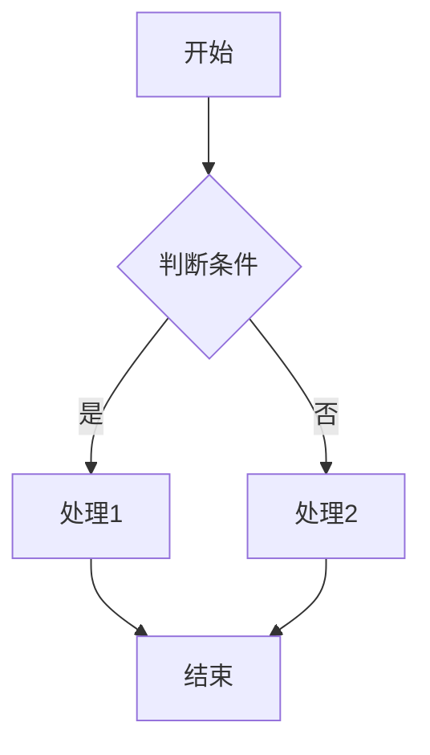
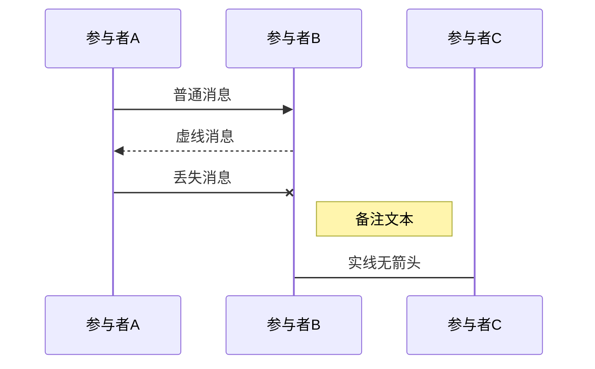
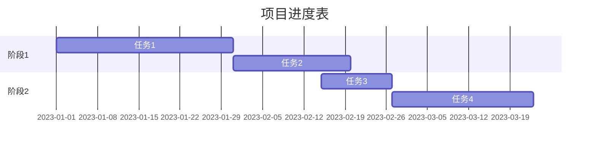
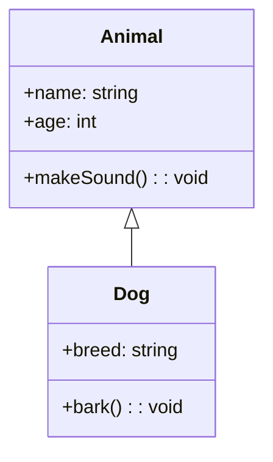
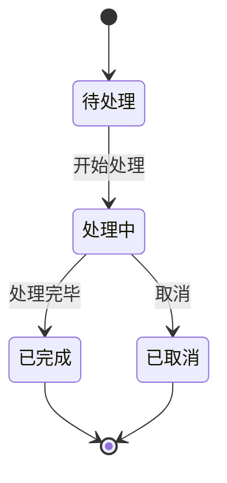
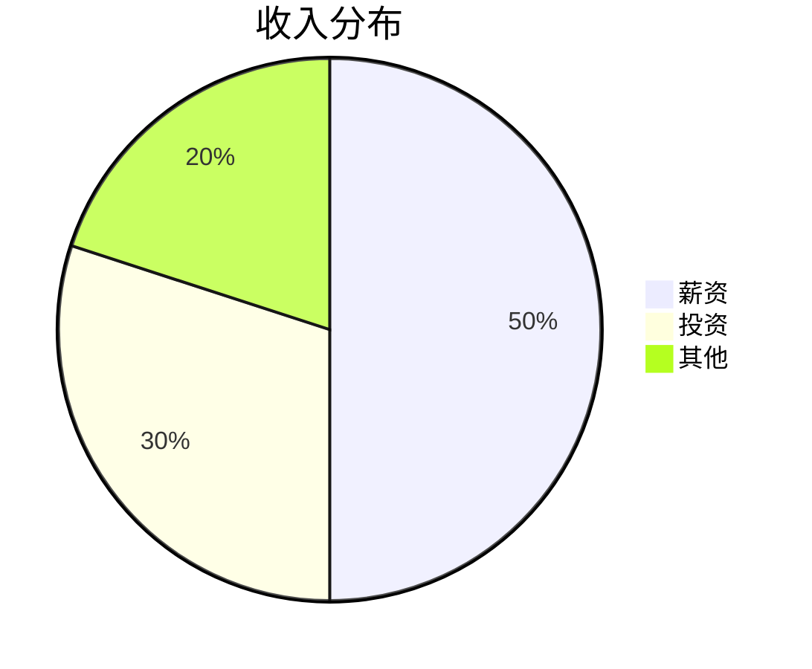
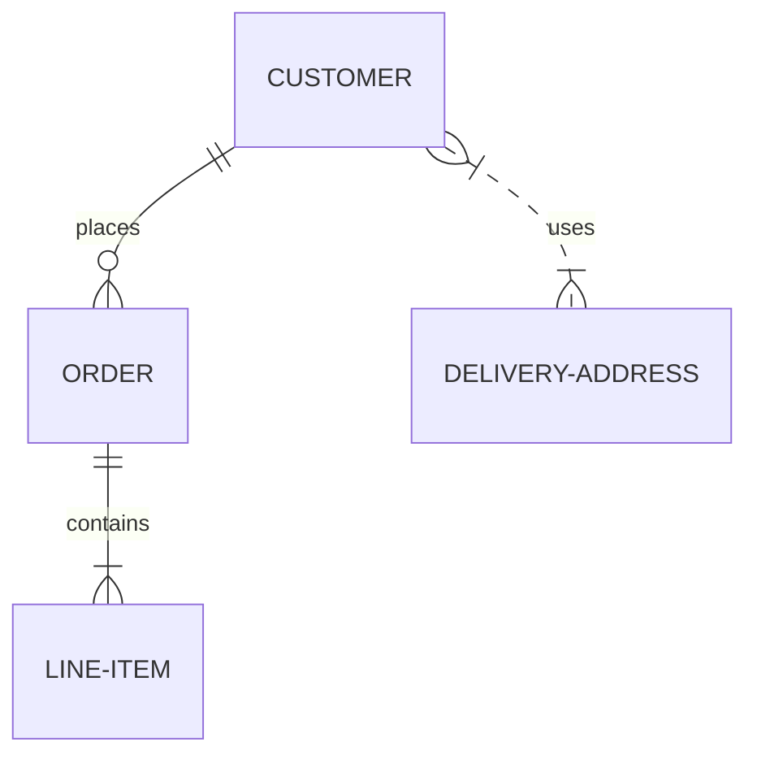
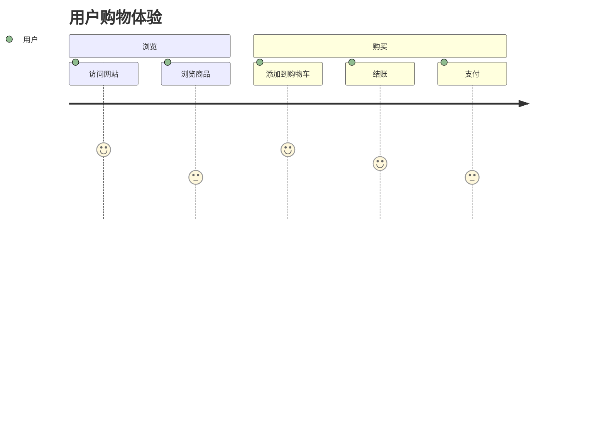

# Mermaid 画图指南

Mermaid 是一个基于 JavaScript 的图表和图形生成工具，它允许您使用类似 Markdown 的文本语法来创建各种图表。下面是 Mermaid 的主要图表类型和基本语法指南：

## 1. 流程图 (Flowchart)

流程图是 Mermaid 最基本的图表类型，用于表示流程或步骤。

### 基本语法

### 方向选项
- `TD` 或 `TB`: 从上到下 (Top to Bottom)
- `BT`: 从下到上 (Bottom to Top)
- `LR`: 从左到右 (Left to Right)
- `RL`: 从右到左 (Right to Left)

### 节点形状
- `[]`: 矩形 - `A[文本]`
- `()`: 圆角矩形 - `A(文本)`
- `{}`: 菱形 - `A{文本}`
- `[]`: 子流程 - `A[[文本]]`
- `[()]`: 圆柱形 - `A[(文本)]`
- `(())`: 圆形 - `A((文本))`

## 2. 时序图 (Sequence Diagram)

时序图用于展示对象之间的交互和消息传递。

### 基本语法

### 消息类型
- `->`: 实线无箭头
- `-->`: 虚线无箭头
- `->>`: 实线有箭头
- `-->>`: 虚线有箭头
- `-x`: 带X的终点(表示丢失)

## 3. 甘特图 (Gantt Chart)

甘特图用于项目规划和进度跟踪。

### 基本语法

## 4. 类图 (Class Diagram)

类图用于展示系统中的类、它们的属性、方法以及它们之间的关系。

### 基本语法

### 关系类型
- `<|--`: 继承
- `*--`: 组合
- `o--`: 聚合
- `-->`: 关联
- `--`: 链接(实线)
- `..>`: 依赖
- `..|>`: 实现
- `..`: 链接(虚线)

## 5. 状态图 (State Diagram)

状态图用于描述系统中的状态转换。

### 基本语法

## 6. 饼图 (Pie Chart)

饼图用于展示比例数据。

### 基本语法

## 7. ER图 (Entity Relationship Diagram)

ER图用于数据库设计，展示实体间的关系。

### 基本语法

### 关系类型
- `||--||`: 一对一
- `||--o{`: 一对多
- `{o--||`: 多对一
- `{o--o{`: 多对多

## 8. 用户旅程图 (User Journey)

用于展示用户体验流程。

## 提示与技巧

1. **样式定制**: 可以通过添加类和样式来自定义图表外观
2. **复杂图表**: 对于复杂图表，建议先在 Mermaid Live Editor 中测试
3. **注释**: 使用 `%%` 添加注释，这些注释不会显示在图表中
4. **子图**: 使用 `subgraph` 创建子图以组织复杂图表
