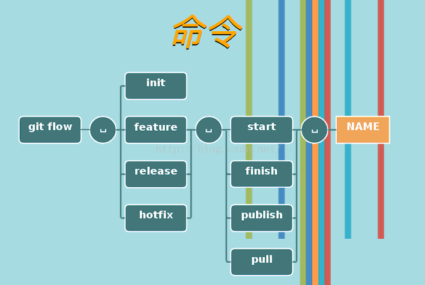

## Git 常用命令
```bash
# 安装后首次需要：
git config --global user.name "cpacm" //设置用户名
git config --global user.email "xxx@1.cn"
git config --global -l 查看全局配置
git config --local -l 查看本地配置

# 初始化工作（选取某个目录）
git init  初始化git项目
git remote add origin ssh://git@almcloud.jwis.cn:22000/git/plmMarket/project增加远程库
git remote set-url --add origin <new-url>
git remote set-url --delete origin <new-url>
 
# 主分支为master 一般需要拉分支出去开发，开发完了再合并到主分支，并把主分支提交
# 对分支的常用操作
git remote -v  //查看本地分支
git remote -a  //查看所有分支
git branch 查看所以分支
git branch -d 分支名   删除分支
git checkout 分支名  切换分支
git checkout -b 分支名  创建新分支并切换到新的分支
 git clone  项目远程地址   //克隆云上的分支
 
# 提交代码的一般流程：
git add XXX   //将文件或者文件夹加入到git管理的仓库。前提是该文件已近在目录下
git commit -m "说明"   //将文件提交到仓库，说明可以写任意内容，当然有意义的最好
git status  //可以实时查看项目的当前状态，如果有状态变化则显示
 
git checkout 分支名  //切换回主分支
git add XXX   //将文件或者文件夹加入到git管理的仓库
git add -A
git pull orgin master 从服务器上下载代码
git push origin master 提交代码到远程库
 
# 其他命令：
git diff fileName 查看文件的修改内容
mkdir dirname 创建一个文件夹
git log --pretty=oneline 查看历史版本信息,后面的参数是一条线查看
HEAD 切换版本 HEAD^ 上一版本 HEAD^^上上版本 HEAD~100 往上100个版本
git reset --hard HEAD^ 切换到上一个版本
git reset --hard 版本id  切换到指定id的版本
git reflog 查看修改的历史版本的信息

```

## Git Flow分支管理流程

