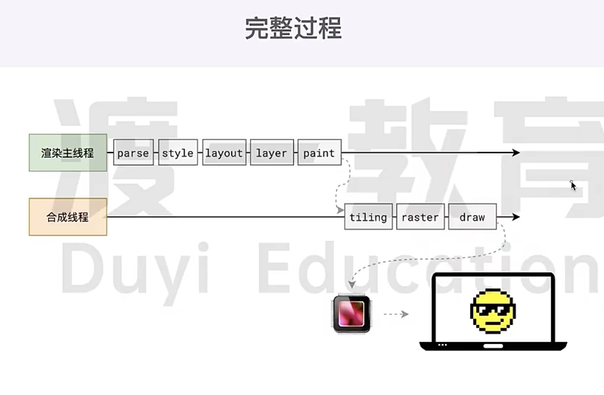
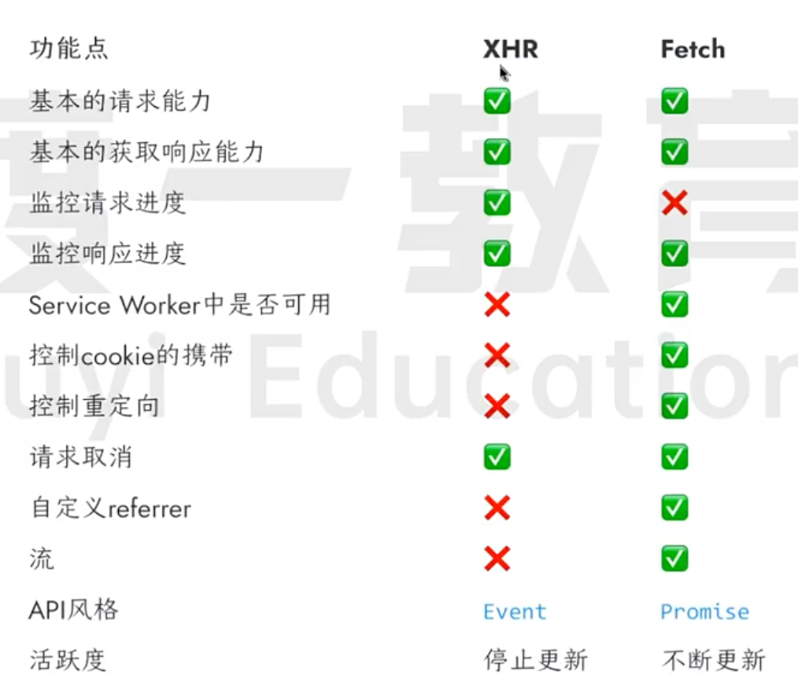

## 聊一聊JS的异步？
Js是一门单线程的语言，这是因为它运行在浏览器的渲染主线程中，而渲染主线程只有一个。而渲染主线程承担着诸多的工作，渲染页面、执行 JS 都在其中运行。   
如果使用同步的方式，就极有可能导致主线程产生阻塞，从而导致消息队列中的很多其他任务无法得到执行。这样一来，一方面会导致繁忙的主线程白白的消耗时间，另一方面导致页面无法及时更新，给用户造成卡死现象。   
所以浏览器采用异步的方式来避免。具体做法是当某些任务发生时，比如计时器、网络、事件监听，主线程将任务交给其他线程去处理，等待任务结束后，转而执行后续代码。当其他线程完成时，将事先传递的回调函数包装成任务，加入到消息队列的未尾排队，等待主线程调度执行。在这种异步模式下，浏览器永不阻塞，从而最大限度的保证了单线程的流畅运行。

## 阐述JS的事件循环？
事件循环又叫做消息循环，是浏览器渲染主线程的工作方式。在 Chrome 的源码中，它开启一个不会结束的 for 循环，每次循环从消息队列中取出第一个任务执行，而其他线程只需要在合适的时候将任务加入到队列未尾即可。   
过去把消息队列简单分为宏队列和微队列，这种说法目 前已无法满足复杂的浏览器环境，取而代之的是一种更加灵活多变的处理方式。根据 W3C 官方的解释，每个任务有不同的类型，同类型的任务必须在同一个队列，不同的任务可以属于不同的队列。不同任务队列有不同的优先级，在一次事件循环中，由浏览器自行决定取哪一个队列的任务。但浏览器必须有一个微队列，微队列的任务一定具有最高的优先级，必须优先调度执行。

## JS能实现精确计时吗？ 

不能。
- 计算机硬件没有原子钟，无法做到精确计时
- 操作系统的计时函数本身就有少量偏差，由于 JS 的计时器最终调用的是操作系统的函数，也就携带了这些偏差
- 按照 W3C 的标准，浏览器实现计时器时，如果嵌套层级超过 5 层，则会带有 4 毫秒的最少时间，这样
- 在计时时间少于 4 毫秒时又带来了偏差受事件循环的影响，计时器的回调函数只能任主线程空闲时还行，因此又带来了偏差
  
:::note
单线程是异步产生的原因，事件循环是异步的实现方式
:::

## 浏览器渲染流程
   
浏览器渲染流程分为以下几个步骤:   
1.  创建 DOM 树
    - 遍历 DOM 树中的所有可见节点，并把这些节点加到布局树中。
2.  CSS 样式计算
    - 创建 CSSOM tree
    - 转换样式表中的属性值
    - 计算出 DOM 节点样式
3.  生成 layout tree
4.  分层
    - 生成图层树（LayerTree）
    - 拥有层叠上下文属性的元素会被提升为单独的一层
    - 需要剪裁（clip）的地方也会被创建为图层
    - 图层绘制
5.  将图层转换为位图
6.  合成位图并显示在页面中
   
浏览器渲染更新机制   
1.  更新了元素的几何属性（重排reflow）
2.  更新元素的绘制属性（重绘repaint）
3.  直接合成（CSS3 属性）


## 什么是reflow?
reflow 的本质就是重新计算 layout 树。   
当进行了会影响布局树的操作后，需要重新计算布局树，会引发 layout。   
为了避免连续的多次探作享致布局树及愛汗算，浏览器会合并这些操作，当 Js 代码全部完成后再进行统一计算。所以，改动属性造成的reflow 是异步完成的。也同样因为如此，当 JS获取布局属性时，就可能造成无法获取到最新的布局信息。浏览器在反复权衡下，最终决定获取属性立即reflow。

## 什么是 repaint?
repaint 的本质就是重新根据分层信息计算了绘制指令。   
当改动了可见样式后，就需要重新计算，会引发repaint。   
由于元素的布局信息也属于可见样式，所以 reflow 一定会引起 repaint。

## 为什么 transform 的效率高？
因为 transform 既不会影响布局也不会影响绘制指令，它影响的只是渲染流程的最后一个「draw」阶段由于 draw 阶段在合成线程中，所以 transform 的变化几乎不会影响渲染主线程。反之，渲染主线程无论如何忙碌，也不会影响 transform 的变化。

## ArrayBuffer数据特点?
ArrayBuffer 是一个表示固定长度的原始二进制数据缓冲区的对象。　　
　
只读的、空间连续、定长字节数组

```js
// 创建一个 16 字节的 ArrayBuffer
const buffer = new ArrayBuffer(16);
console.log(buffer.byteLength); // 16

```
ArrayBuffer 本身不提供读写数据的方法，需要通过"视图"对象来访问：

- TypedArray 视图：如 Int8Array, Uint8Array, Float32Array 等
- DataView 视图：提供更灵活的读写操作，可以控制字节序

[ArrayBuffer详细](../javascript/ArrayBuffer.md)

## xhr和fetch的区别？


