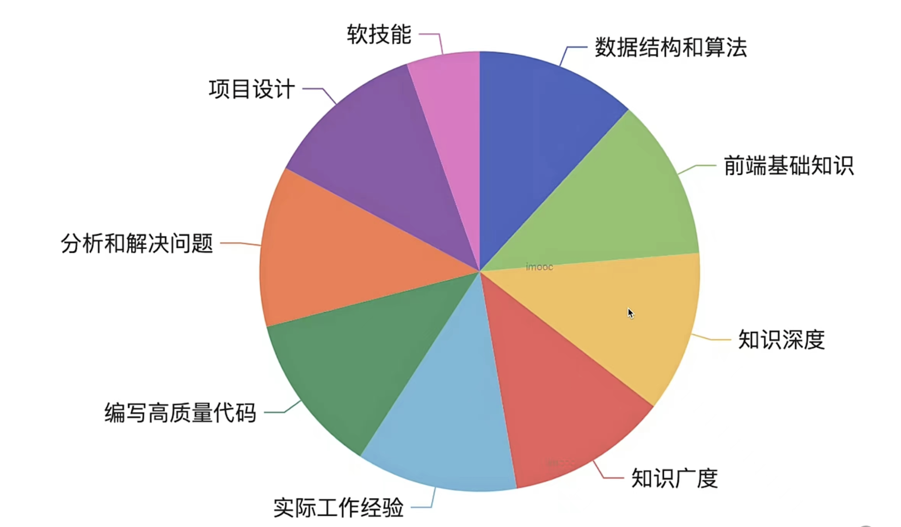

 

 ## 常见面试题

 ### 防抖和节流

 区别：
- 触发频率不同
- 防抖：在一定时间内没有再次触发，才执行一次函数
- 节流：在一定时间内只执行一次函数
　
 实现：

 ```js
 // 防抖
 const debounce = (fn = {}, wait = 50, immediate) => {
    let timer
    return function () {
        if (immediate) {
            fn.apply(this, arguments)
        }
        if (timer) {
            clearTimeout(timer)
            timer = null
        }
        timer = setTimeout(() => {
            fn.apply(this, arguments)
        }, wait)
    }
}

// 节流
var throttle = (fn = {}, wait = 0) => {
    let prev = new Date()
    return function () {
        const args = arguments
        const now = new Date()
        if (now - prev > wait) {
            fn.apply(this, args)
            prev = new Date()
        }
    }
}


 ```

 使用场景：
 - 防抖限制执行频率，关注结果
 - 节流限制执行次数，关注过程

 
 ### CSS中的基本单位

px, em, rem, vw, vh, %的区别

 - px：绝对单位，固定大小
 - em：相对单位，相对于本元素的字体大小
 - rem：相对单位，相对于根元素的大小
 - vw：相对单位，相对于视窗的宽度
 - vh：相对单位，相对于视窗的高度
 - %：相对单位，相对于父元素的大小


  ### 箭头函数

 缺点：

 1. 箭头函数没有自己的this，箭头函数的this是继承外层代码块的this
 2. 没有arguments对象　
 3. 无法通过call、apply、bind改变this指向
 4. 箭头函数不能作为构造函数，不能使用new
 5. 嵌套箭头函数不太好理解　
   　

 什么时候不能使用箭头函数？

 - 对象方法中
 - 动态上下文中的回调函数
 - 结构函数中
 - 原型方法中
 - vue生命周期和method中

 ### TCP请求中的三次握手和四次挥手

三次握手：

1. 客户端发送一个建立连接请求给服务端
2. 服务端收到请求后，回复一个可以接受信息给客户端
3. 客户端收到信息后，回复一个准备发送信息给服务端

四次挥手：
1. 客户端发送一个断开连接请求给服务端
2. 服务端收到请求后，回复一个收到断开信息给客户端
3. 服务端处理完毕后发送一个可以断开连接信息给客户端
4. 客户端收到信息后，发起一个断开连接请求给服务端

 ### for...in 和 for...of 的区别

区别：适用于不同数据类型

for...in 用于可枚举数据，如数组、对象、字符串等，得到key

for...of 用于可迭代数据，如数组、字符串，Map，Set等，得到value

- 遍历对象：for...in 可以使用，for...of 不能使用
- 遍历Map，Set: for...of 可以使用，for...in 不能使用
- 遍历Generator: for...of 可以使用，for...in 不能使用


 ### for await ...of 

用于遍历多个Promise等异步任务　


### offsetHeight、clientHeight、scrollHeight的区别

offsetHeight，offsetWidth：border + padding + 内容高度

clientHeight, clientWidth：padding + 内容高度

scorllHeight, scrollWidth ：padding + 实际内容尺寸


 ### HTMLCollection 和 NodeList 的区别

HTMLCollection为Eement的集合，NodeList为Node的集合

Node是DOM树中的所有节点

Node是Element的父类

扩展：HTMLCollection和NodeList是伪数组，不能使用数组的方法
```js
const list = document.getElementsByTagName('div')
const arr1 = Array.from(list);
const arr2 = [...list];
const arr3 = [].slice.call(list);
```

### Vue中computed和watch的区别

computed：
- 计算产生新的数据
- 依赖其他属性值，根据其变化而变化
- 有缓存性

watch：
- 监听现有数据
- 当其发生变化时执行回调函数

 ### Vue组件通信方式有哪些？

- props和$emit
- 自定义事件
- $attrs
- $parent
- $refs 
- provide / inject
- vuex

 ### vuex中的mautions和actions的区别
mautions：原子操作，必须同步代码

actions：可包含多个mautions，可包含异步代码

 ### JS严格模式特点

1. 全局变量必须先声明再使用
2. 禁止使用with语句
3. 禁止this指向全局对象
4. 创建eval作用域
5. 函数参数名不能重名

 ### http跨域请求为什么要发送option请求

option是在跨域请求前的预检查请求，用于判断服务器是否允许跨域请求

option是浏览器主动发送，无需用户干预

浏览器触发option的条件：
1. 请求方式为put、delete
2. 请求头包含自定义字段
3. 请求头包含content-type字段，且不为application/x-www-form-urlencoded、multipart/form-data或text/plain


 ### JS垃圾清理算法

标记清除算法


 ### WeakMap/WeakSet
它们都是弱引用，当对象不再需要使用时，会自动回收

它们的key必须是引用类型，且不能重复


 ### VDOM　真的很快吗

- VDOM并不快，直接操作DOM才是最快的
- 数据驱动视图要有合适的方案，不能全部重建DOM
- VDOM是目前最合适的方案

 ### for和forEach哪个快
for更快，因为forEach在每次执行中要初始化一个函数来进行调用，而for循环不需要；函数创建会有额外的开销

 ### JS-Bridge实现原理

- 注入全局API
- URL Scheme

 ### requestAnimationFrame 和　requestIdleCallback区别

requestAnimationFrame：浏览器下次重绘前调用，高优

requestIdleCallback：在浏览器空闲时执行，低优

 ### Vue什么时候操作DOM比较合适

mounted阶段和updated阶段都不能保证子组件全部挂载完成

使用$nextTick来渲染DOM

 ### Vue2、Vue3和React　diff算法的区别

React diff: 仅右移
Vue2 diff: 双端比较
Vue2 diff: 最长递增子序列

 ### Vue和React中为循环时必须使用key
- vdom diff算法会根据key来判断元素是否删除
- 匹配了key，刚只移动元素，性能较好
- 未匹配key, 删除元素再创建，性能较差

 ### Vue Router 的三种模式

- hash: 默认模式，使用URL的hash值来作为路由
- web history: 使用URL的history模式，需要服务器支持
- memory history: 不使用URL，将路由保存在内存中


### 如何解决移动端H5　click 有300ms延迟

背景：　double tap to zoom

解决方案：fastClick

`<meta name="viewport" content="width=device-width" />`

### Retina 屏幕的 1px 像素，如何实现

使用css伪类　+  `transform` 把高度缩小0.5倍

### 网络请求中的token和cookie有什么区别
cookie: 
- 由于http是无状态的，在每次请求中携带cookie可以帮助识别身份
- 服务端可以向客户端set-cookie，大小限制为4kb
- 默认有跨域限制，不可跨域共享、传递cookie

区别：

- cookie是http规范，而token是自定义传递
- cookie默认会被浏览器存储，而token需要自己存储　
- token没有跨域限制

cookie: HTTP标准；跨域限制；配合session使用

token: 无标准，无跨域限制；用于JWT（JSON  Web Token）

### Session　和　JWT各有何优点

seesion优点: 
- 原理简单，易学习
- 用户信息存在在服务端，强管理，可以快速封禁某个用户

session缺点：
- 占用服务端内存，硬件成本高
- 多进程、多服务时，不好同步，需使用第三方缓存（redis) 
- 默认有跨域限制

jwt优点：
- 不占用服务端内存
- 多进程、多服务器不受影响
- 没有跨域限制

jwt缺点：
-  用户信息存在在客户端，无法快速封禁某用户
-  密钥泄漏后，用户信息全部丢失　
-  token体积比cookie大，会增加请求数据量

### 如何实现SSO单点登录

基于cookie: cookie默认情况下不可跨域共享，但有些情况可以设置共享

- 主域名相同。如www.baidu.com, image.baidu.com，设置cookie domain为主域名，即可共享cookie
- 主域名完全不同，则不能共享cookie

使用SSO技术方案：独立SSO服务管理登录校验

OAuth 2.0: 第三方登录检验　


### Http 1.0, 1.1, 2.0区别

1.0：　
- 最基础的http协议
- 支持基础的GET、POST请求
- 不支持长连接

1.1：
- 支持长连接
- 缓存机制　cache-control,E-tag
- 断点续传，状态码206
- 支持新的方法：PUT、DELETE等

2.0：
- 可压缩header，减小数据量
- 多路复用，一次tcp连接可发送多个http请求，提高效率
- 服务端推送，服务端主动向客户端发送数据
- 数据传输为二进制格式，传输效率更高

### 什么https中间人攻击？如何预防

重点：https　加密过程

### script标签的defer和async的区别
defer: 异步加载，不会阻塞页面解析

async: 异步加载并执行，会阻塞页面解析

### prefetch 和　dns-prefetch的区别

prefetch和preload:

- prefetch: 预加载，资源在未来页面使用，浏览器空闲时加载

- preload: 预加载，资源在当前页面使用，浏览器解析时加载

dns-prefetch 和　preconnect:

- dns-prefetch: DNS预解析

- preconnect: DNS预连接

### 前端攻击有哪些？如何预防

- xss: 跨站脚本攻击。通过在页面插入恶意代码，获取用户信息
  - 预防：过滤用户输入，替换特殊字符；设置cookie为httponly
- csrf: 跨站请求伪造。通过伪造http请求，获取用户信息
  - 预防：设置token，验证请求来源；严格的CORS策略+验证码机制；设置cookie为SameSite，禁止跨域共享
- 点击劫持：通过设置透明的iframe，诱导用户点击
  - 预防：设置X-Frame-Options=SAMEORIGIN,禁止iframe加载

- DDoS: 分布式拒绝服务。通过大量请求，使服务器资源耗尽
- sql注入：插入恶意sql语句，破坏数据库
  - 预防：使用ORM框架，过滤特殊字符

### websocket和http的区别

websoket:
- 双向通信，端对端通信
- 无跨域限制
- 协议名：ws://
- 通过send/onmessage通讯
- 全双工通信
  
http：
- 单向通信，客户端到服务器
- 协议名：http://

### websocket和http长轮询的区别
http: 通过等待来实现长轮询
websocket:　互相发送消息，不需要等待

### 网页从url到渲染完成的过程

- 网络请求
  - dns解析
  - 浏览器发送http请求
  - 收到http响应，得到html文件
  - 请求静态资源文件
- 解析（字符串数据到结构化数据）
  - HTML构建DOM树
  - CSS　构建CSSOM树
  - 最后合并DOM和CSSOM形成render树
- 渲染
  - 计算各个节点的布局
  - 遇到js可能会阻塞渲染，执行js代码
  
:::note
优化解析

1. css放在head中，js放在body底部
2. 使用link标签引入css文件
3. 合理使用async和defer属性
4. img元素提前定义好width和height属性
:::

### repaint(重绘)和reflow(重排)的区别
repaint: 重新绘制，重绘DOM元素
- 元素外观改变，如：color
- 元素尺寸、位置不变，不影响其它元素位置

reflow: 重新布局，重排DOM元素
- 重新计算DOM元素的几何属性
- 会影响其它元素的位置和尺寸

:::note
如何减少reflow
1. 批量修改DOM样式
2. 修复样式之前先隐藏元素，使元素脱离文档流
3. 使用BFC（块级格式化上下文）特性，不影响其它元素位置
4. 频繁触发的resize/scroll事件，使用requestAnimationFrame;防抖和节流
5. 使用createDocumentFragment创建虚拟节点，减少DOM操作
6. 优化动画效果，使用transform: translateZ(0)开启GPU加速
7. 使用css3动画，减少js操作

BFC形成或者触发条件？
1. 根元素
2. float: left/right
3. overflow: auto/scroll/hidden
4. display: inline-block/table-cell/table
5. display: flex/gird
6. position: absolute/fixed
:::

### 如何实现多标签页通讯
- WebSocket通讯
- 本地存储
  - localStorage: 永久存储，容量5M
  - sessionStorage: 临时存储，页面关闭后消失
- SharedWorker通讯: 共享的Web Worker

### 如何实现网页和iframe之间的通讯

使用postMessage方法发送消息，使用onmessage事件接收消息

### H5页面如何进行首屏优化
- 路由懒加载（只适用于SPA）
- 图片懒加载
- 使用CDN
- 使用SSR
- APP 预取数据，适用于APP中的H5页面
- 分页

### 10万条数据如何渲染
- 虚拟列表
- 分页

### 常用设计模式和应用场景
前端常用设计模式
- 工厂模式：　$(),React.createElement
- 单例模式：　new Vue()
- 观察者模式：事件监听
- 发布订阅模式：Vuex、Redux

:::note
#### 设计原则：
设计原则是指导软件开发过程中提高代码质量、可维护性和可扩展性的基本准则。以下是一些重要的软件设计原则：

1. 单一职责原则 (SRP)
每个类或模块应只有一个职责，避免承担过多功能。

2. 开放封闭原则 (OCP)
软件实体（类、模块、函数等）应对扩展开放，对修改封闭。也就是说，应该可以通过添加新代码来扩展功能，而不是修改现有代码。

3. 里氏替换原则 (LSP)
子类对象能够替换父类对象，并且程序的正确性不受影响。这要求子类必须遵循父类的行为契约。

4. 接口隔离原则 (ISP)
不应强迫一个类依赖它不需要的接口。应该将大接口拆分成小接口，以便实现类只需实现它们感兴趣的方法。

5. 依赖倒置原则 (DIP)
高层模块不应依赖于低层模块，两者都应依赖于抽象。抽象不应依赖于细节，细节应依赖于抽象。

6. 最少知识原则 (Law of Demeter)
一个对象应尽量少地了解其他对象。也就是说，一个对象只应与直接的朋友交互，减少系统的耦合度。

7. 优先使用组合而非继承
通过组合来构建功能，而不是通过继承。这有助于提高代码的灵活性和可重用性。

8. KISS 原则 (Keep It Simple, Stupid)
保持设计简单，避免不必要的复杂性。

9. YAGNI 原则 (You Aren't Gonna Need It)
不要添加尚未需要的功能。只实现当前需求，避免过度设计。

10. DRY 原则 (Don't Repeat Yourself)
避免代码重复，确保每个知识点在代码中只有一个表达。

:::

### 观察者模式和发布订阅模式的区别
观察者模式：
- Subject和Observer之间直接绑定，没有中间媒介
- 一对多关系

发布与订阅模式：
- Publisher和Subscriber互不认识，需要中间媒介Event Bus进行通讯，如自定义事件
- 一种更松散耦合的设计模式

### Vue工作中的优化
1.　v-if和v-show的使用，v-if会销毁和重建DOM，v-show只是改变css的display属性，不要过度优化
2. v-for中使用key
3. 使用computed进行缓存　
4. keep-alive缓存组件
5. 异步组件，拆分体积比较大的组件
6. 路由懒加载
7. 服务端渲染SSR

### Vue使用踩过的坑
- 内存泄漏（全局变量，全局事件、全局定时器未销毁）
- 路由切换时，页面滚动到顶部（解决方案：列表页缓存加载数据和scrollTop，返回是执行scrollTop方法）

:::note
工作中要注意记录遇到的坑，避免下次再踩
:::

### React工作中的优化
1. Fragement组件代替div，减少DOM层级
2. jsx中尽量不定义函数
3. 使用React.memo()进行组件缓存
4. 使用React.lazy()进行懒加载
5. useCallback代替内联函数
6. 使用shouldComponentUpdate进行组件优化
7. 异步组件，拆分体积比较大的组件
8. 路由懒加载
9. SSR(next.js)


### React使用踩过的坑
- 内存泄漏（全局变量，全局事件、全局定时器未销毁）
- 路由切换时，页面滚动到顶部（解决方案：列表页缓存加载数据和scrollTop，返回是执行scrollTop方法）
- 引用类型数据更新时，组件未重新渲染（不可变数据，不能在原数据地址上进行修改）
- js关键字冲突，for改为htmlFor, class改为className
- setState是异步的，不能立即使用state

### 如何统一监听Vue组件报错
-　window.onError，监听所有未捕获报错，包括异步报错
- errorCaptured生命周期，监听所有下级组件报错，返回false不会向上传递
- app.config.errorHandler，监听所有组件报错

### 如何统一监听React组件报错
- ErrorBoundary组件，监听所有下级组件报错，可降级展示UI; 只监听渲染阶段报错
- window.onerror，监听所有未捕获报错，包括异步报错
- try-catch，监听事件回调函数报错

### 如何排查页面慢的原因

通过使用Chrome DevTools进行性能分析，找到导致页面慢的原因。

根据原因对症下药，解决问题

持续跟踪，持续优化

### 项目有有哪些难点，如何解决
答案模板：
- 描述问题：　背景　+　现象　+　造成的影响
- 问题如何被解决：　分析　+　解决
- 自己的成长：学到了什么　+ 以后如何避免
  
:::note

注意平时工作中的积累，写一篇文章记录一下

:::


### {}和Object.create()创建对象的区别
- {}创建对象，使用new关键字调用构造函数，原型指向Object.prototype
- Object.create()创建对象，不使用new关键字调用构造函数，原型指向Object.create()的参数


