## 什么是营销

营销是企业理解顾客，创造顾客价值，传播顾客价值和交付顾客价值的完整过程。

我们可以从三个视角来理解营销：
1. 顾客价值创造
2. 企业经营理念
3. 企业执行流程

### 顾客价值创造

#### 1\. 认知顾客价值

1. 市场调研
2. 用户访谈
3. 用户观察
4. 发现顾客需求
5. 新市场空白点
6. 顾客需求本质
   
#### 2\. 创造顾客价值

1. 把顾客需求变成产品和服务
2. 满足顾客需求
   
#### 3\. 传播顾客价值

1. 传播产品差异化
2. 解决顾客利益
3. 影响目标顾客

#### 4\.交付顾客价值

1. 分销
2. 培训服务人员
3. 指导实践
4. 方便顾客购买、使用和导入产品

### 企业经营理念

以顾客价值为中心的核心理念。

**企业经营理念的变迁**

*过去的经营理念*   
  
过去企业围绕着资源来展开生意，只要能做出好的产品，只要能大规模生产就能挣钱。在顾客很丰富，但是产品稀缺的时代，企业的经营理念是大规模生产和销售，获取生产技术，获取生产能力，大面积分销。

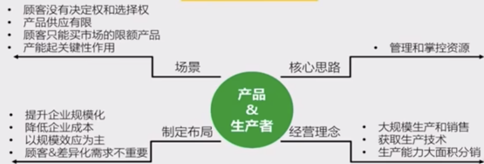

以产品为中心，以企业为中心。福特在 19、20 世纪说的话是非常典型的以生产者为视角的企业经营理念。此时营销还没有出现。

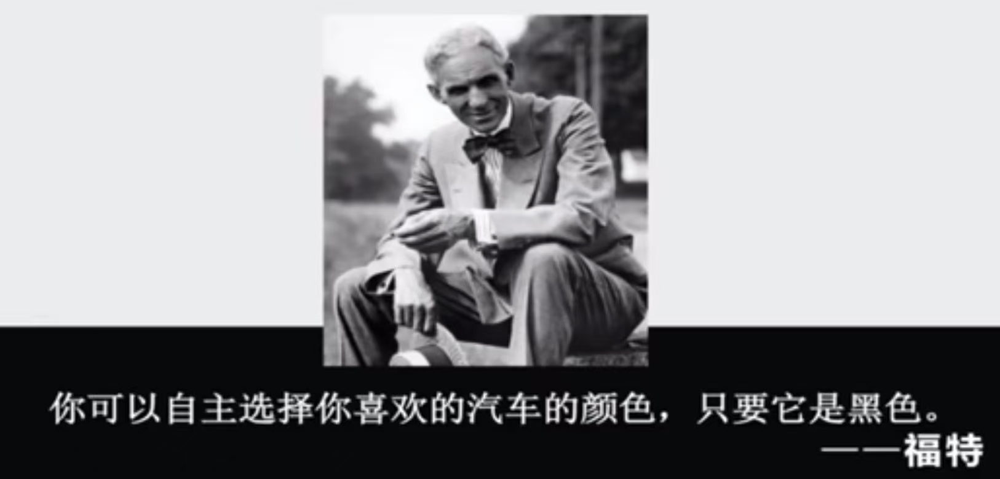

*现在的经营理念*

营销的出现是在充分竞争，消费者需求差异化，产品过剩，消费者选择多样化的时代。

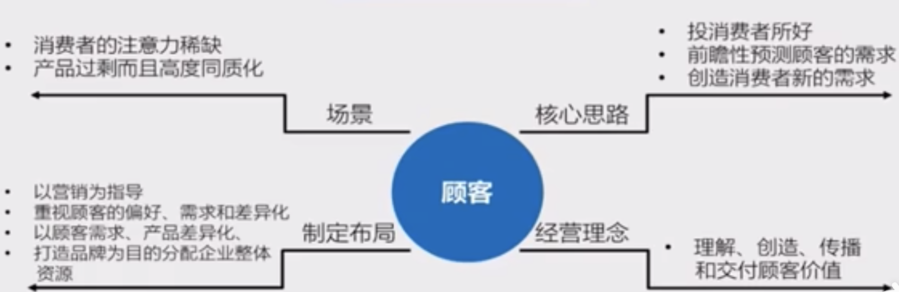

### 企业执行流程

营销是一个从激发市场需求，产生销售线索到发现有效的潜在客户，到销售跟踪，形成交易，顾客再次购买，形成顾客忠诚这样一个完整的执行链条。

`销售线索 --> ...... --> 顾客忠诚`

营销是一个环环相扣，高度严密的执行流程。企业称之为 L2C (List to controller) 的流程。

## 营销的内涵

五个营销模型：**4P，7P，4C，内部营销，关系营销**

### 经典 4P

产品 - 价格 - 推广 - 渠道

**产品 (Product)：产品自检清单**

1. 定位
2. 目标顾客
3. 核心功能
4. 顾客核心利益点
5. 差异点
6. 单款产品 Or 产品线组合

对于产品线组合，我们可以考虑不同产品通过结构化的互相支撑，打赢市场竞争，哪些产品可以用来打价格战，哪些产品用来获得利润，哪些产品是用来打造品牌和领先认知的。

**价格 (Price)**

世界上没有卖不出去的东西，只有卖不出去的价格。价格策略的制定非常重要，企业最终形成的交易是靠定价来产生利润和收入的。定价有很多种方式，依据所处行业和市场情况

1. 随行就市定价法，取行业平均定价来定价。很多企业是没有定价权的，对定价权的争夺是营销重要的目的，主要在于打造品牌。
2. 成本加成定价法，按照成本和合理利润率来定价，通常用在公用事业，比如高速公路收费站，废品处理站。通常在半垄断性行业，需要管制利润获取。
3. 价值定价法，让消费者觉得物有所值，划算。例如沃尔玛的天天低价，海尔的物超所值，雷克萨斯的奔驰的感受，雷克萨斯的价格。
4. 感知价值定价法，为顾客创造的总体价值定价，包含了产品的使用价值，经济价值和情感价值。如依云矿泉水和怡宝矿泉水的定价，代表了情感价值定价和随行就市定价，依云矿泉水一瓶 20 元，成本 5 元；怡宝一瓶 2.5 元，成本 2 元，依云传递的是一种健康幸福的心理状态，通过品牌打造创新。
5. 歧视定价法，按照场景不同，需求不同，过去的经历不同，为同样的产品定取不同的价格。如同样的航班，同样的座位，不同的价格；保险公司不同价格的车险。差异化定价法是通过对顾客使用的需求认知，对企业最大化收益。要实现差异化定价需要大量顾客的行为数据作为支撑，如大数据，根据你的行车数据，路径数据来判断你出车祸的可能性。    

基于顾客行为差异和顾客人群差异的差异性定价，是未来定价的趋势，也是企业未来获得竞争优势一个非常关键的领域。

**推广 (promotion)**

这是营销中谈的最多的概念，推广涵盖了很多整合营销传播。现在渠道发生了很大的变化，从过去电视、广播、户外到现在的线上、线下、移动端、社交媒体、精准投放。媒体渠道高度发达的时候，当顾客通过社交平台，移动互联网，各种移动终端可以有效的参与到产品讨论甚至顾客本身就制造和产品有关的内容的时候，推广就变得空前复杂，同时充满机会。

过去讲整合营销传播 (IMC)，单一媒体的投资回报率，讲究拍一个广告投放户外获得的曝光来衡量该媒体带来的投资收益率。现在不仅仅要关注简单投放，而是需要关注媒体组合，需要关注媒体之间的相互依存度。现在我们很难用单一的手段来推广产品，也很难衡量单一媒体推广渠道对品牌带来的单一媒体投放回报率。

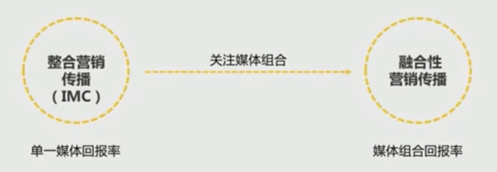

以丰田汽车为例

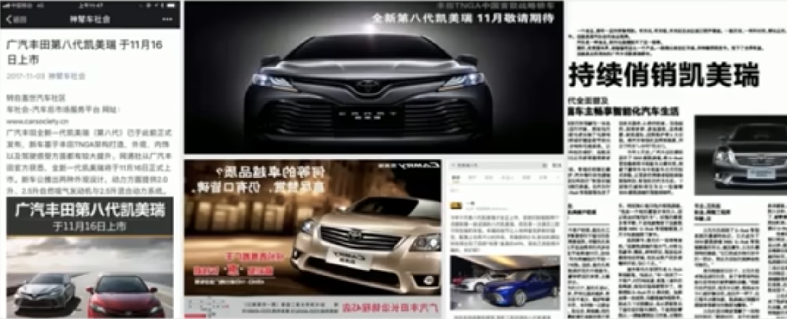

以该车的客户视角分析，他早上看到了朋友圈的丰田八代广告，然后在报纸上又看到了该广告，又听广播听到了该广告，又在邮箱里看到优惠券，最终产生了购买行为，那么在以上的各种渠道中，我们将很难区分是哪个广告最终形成了交易。故而我们需要形成一种全媒体整合的投资模型。

除了企业单向投放广告之外，新的传播现实是顾客越来越成为品牌声音的一部分。企业传播已经成为融合化的客户沟通，即融合企业产生的内容、顾客产生的内容和顾客评论之后，形成的综合性的内容营销。

**渠道 (place)**

渠道包括经销商、代理商、终端零售商，是不为企业所控制的社会合作资源。

前 3 个 P 都相当大的可以为企业所控制，唯有分销渠道不为企业所控制，是一种合作资源。对该 P，企业需要有强大的协调管控能力。在企业营销中，该 P 的变数最大，且该 P 做好了，可以获得意想不到的成功和突破。

一般在本土企业与跨国公司的竞争中，该 P 尤为明显。

| 跨国公司     | 本土企业     |
| :-------    | :-------|
| 品牌塑造能力   | 经销商管理       |
| 定价机制      | 本地渠道构建      |
| 产品线运用能力 | 渠道成员激励和能力培养 |

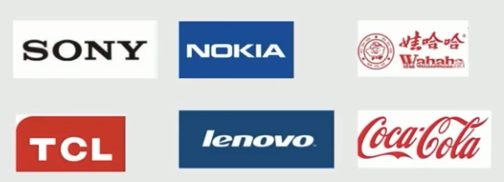

例如家电领域，TCL、创维超出了日本的家电商，中国手机超越了诺基亚。在分销渠道中，国内的王老吉、哇哈哈超越了国外饮料的销售。这些创新全部发生在渠道端。

今天营销的新现实，渠道也发生了重大的变化

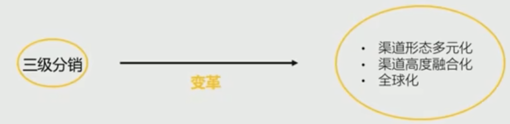

从过去的三级分销 (公司厂家、总代理、经销商)，效率非常低，到处窜货。到今天很多新的渠道形态 —— 电商 (如淘宝、京东) 实现了扁平化的销售渠道方式 (快递)，直接实现了一级分销。又如线上线下的 `O2O`。今天的渠道路径，渠道形态已经高度多元化。另外有大量的零售商进行整合，终端力量的延伸。

今天的情况是渠道高度融合化，线上线下无缝连接，共享相同的数据，顾客希望从不同渠道获得一致性的体验。

分销领域被新的技术变革，营销的 4 个 P 涵盖了最核心的几个内容。无论技术如何变化，无论市场如何变化，营销的核心工作不变，但是内涵在发生变化。

**营销新现实**

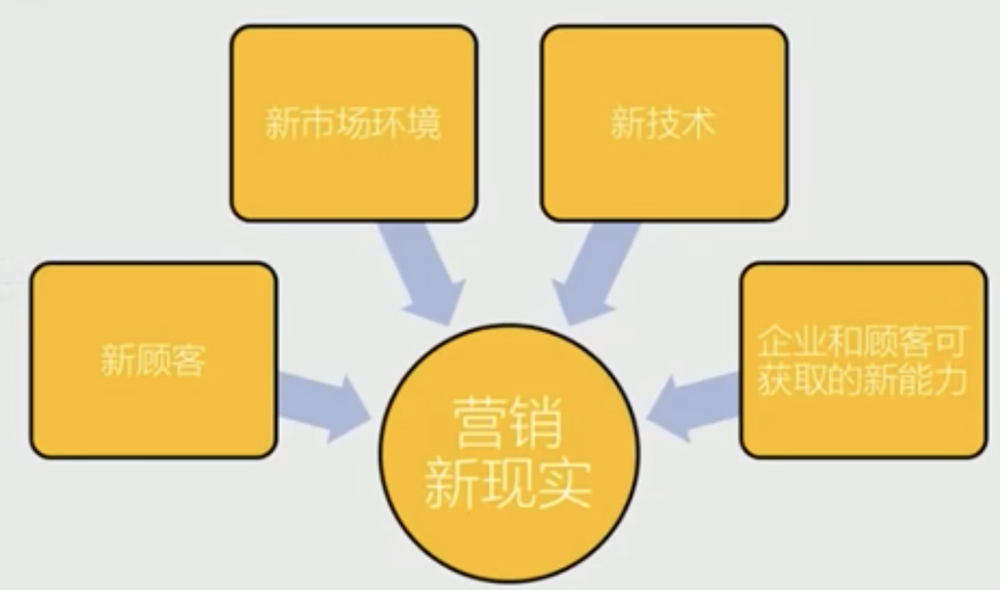

新顾客、新市场环境、新技术、企业和顾客可获取的新能力构成了营销的新现实。由三股驱动力驱动着营销新现实的形成。

1. 全球化，中国的竞争就是全球的竞争。
2. 技术，电子商务、精准定位、智能推荐、条形码、O2O、AI，这些技术使得营销，与顾客的关系史无前例的更加紧密。反应速度变成了实时营销。
3. 社会责任，企业对社会责任的必须担当成了推动成长的第三大原因。

### 7P

**7P** 相对于 **4P** 增加了 —— 流程，人员、展示

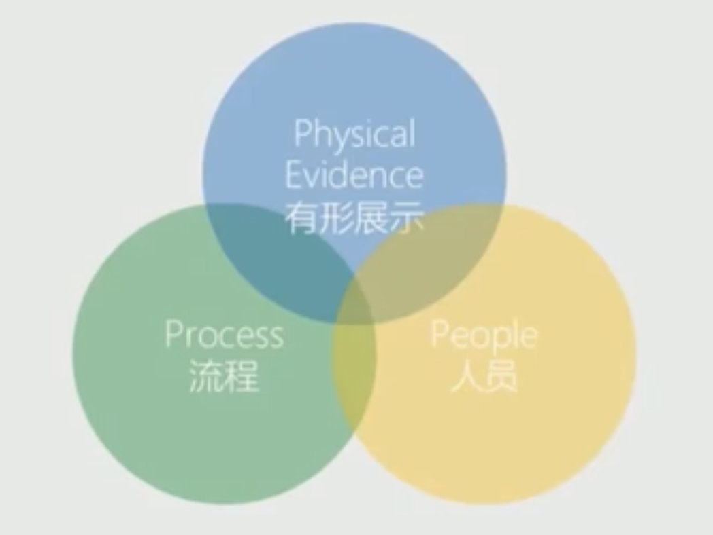

人是交付产品最为重要的，需要非常精密的流程来驱动业务，有形展示让看不见摸不着的服务变成有切身的感知。7P 主要是解决服务行业的营销手段。

### 4C

**4C** 是以企业厂家的视角， **4P** 转换到以顾客视角来看待的营销。

客户需求 - 成本 - 沟通 -- 便利

**客户需求 (customer demand)**

企业销售的是产品，但是对顾客来说，购买的是**问题的解决方案**。企业做营销的误区在于总是盯着卖的产品，而忘了企业的初心要为顾客解决问题，**产品只是解决问题的手段和工具**。

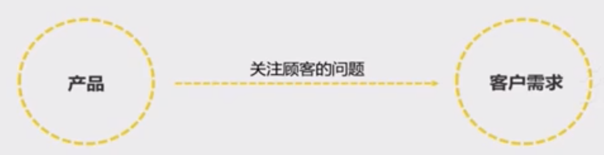

以家得宝 (The Home Depot) 钻头为例

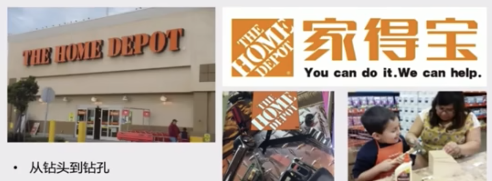

当研究人员询问该公司的销售经理，你们的钻头为什么卖的那么好，销售经理说他们的钻头型号齐全，质量好，耐用，价格合理，有品牌。当研究人员询问买了钻头的顾客的时候，顾客说用这家公司的钻头钻的眼又快又平又光，而且一次钻成。由此我们会发现，厂家卖的是钻头，而顾客买的是钻孔。

**成本 (cost)**

企业关注的是定价策略，但顾客看的是**总体购买成本**，成本不仅仅包括购买金额，机会成本，培训成本，选购花费的时间等。对顾客来说价格只是整体购买成本当中的一部分。特别是在 B2B，重大购买领域，买错了，后果很严重。比如说买一罐可乐，买错了后果无所谓，但是在购买人寿保险、房产、汽车等的时候，买错了，后果比较严重，所以顾客会花费大量的时间去比较，对比。

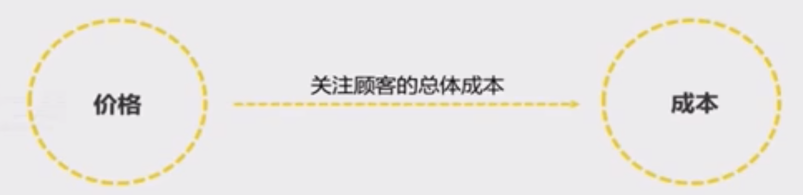

所以在我们定价的时候，我们应当考虑**降低顾客的总体成本**，而不是降低价格。

以 2B 领域的采购经理关注什么来说明

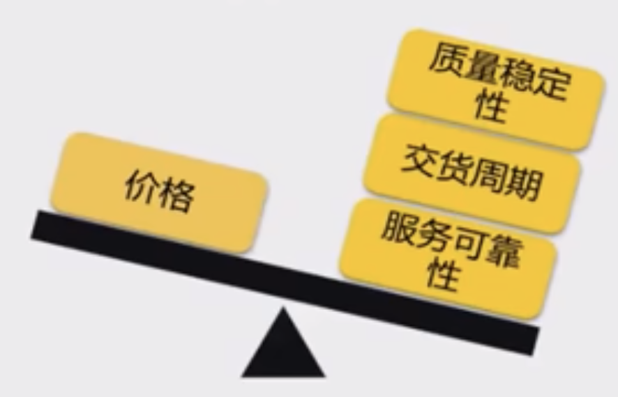

对美国 2000 多家 B2B 供应商调查发现，采购经理决定购买哪家货物时，价格因素通常只排在第四、五位。比价格更重要的因素，质量的稳定性，交货周期，服务可靠性。因此从价格到总体成本改变的认知为我们打开了一扇竞争的窗口。

**沟通 (communicate)**

| 企业的关注点 | 顾客的关注点 |
| :------     | :------ |
| 广告       | 真诚的沟通  |
| 品牌认知    | 有价值的沟通 |
| 口碑       | 有价值的关系 |

当我们去参加一些聚会，论坛，在其中，我们会跟别人交流，交换名片，但真正能够保持关系，构建长久合作的少之又少，大多数情况下，这种关系都无法为他人创造价值。产品和企业也是一样，如果企业对顾客的关系当中，通过社交媒体，通过微博，通过 CRM，如果通过这些方式的沟通很无聊，那么这种关系必然会断裂。所以从 4P 中的推广到 4C 的沟通，这种沟通一定是有价值的关系构建。

**便利 (convenience)**

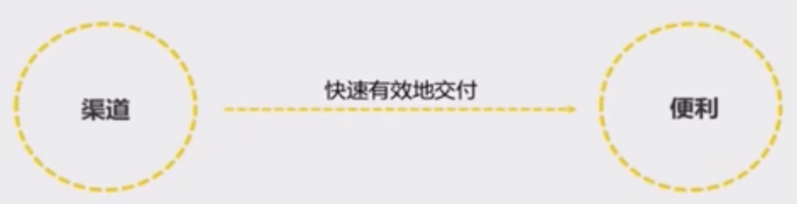

渠道需要无缝连接，丰富过程的体验，有效快速的交付。

4C 是对营销新现实包含的新顾客、新能力、新媒体、新竞争的一个直接回应，是营销领域中最大的变革之一。

### 内部营销

企业营销应该是一个由内而外的过程，内部营销是将**企业的品牌**、**定位**和**价值诉求**有效的传播给企业内部所有的岗位，让每个人都能认识企业共同的信息和使命，同时将顾客价值关联每一个岗位的工作，从而真正兑现对顾客的承诺。

企业往往忽视吸纳、培养、留住人才的竞争。企业的竞争永远为两个方面，**一方面获取顾客**，**一方面获取人才**。营销一方面获取顾客，一方面需要把理念变成内部共识。内部营销是所有卓越营销公司的特点。

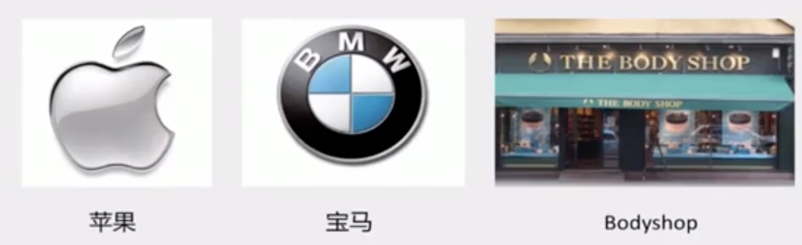

这些公司的营销理念深深进入该公司每个工程师的内心当中。对于 Bodyshop，无论是到他的零售店，工厂，都能一致的感受到工厂工人、服务人员和店面的服务人员的理念，价值观和态度都是一致的，因为该公司将他们强大的营销使命 —— 不杀害动物，不用动物油脂，创造美好的社群变成了每个人的价值观。当一个企业做到这种程度的时候是有极强的感召力的，他能吸纳一批人对其忠诚。所以内部营销是一个非常关键的过程。

### 关系营销

构建有价值的顾客关系

营销新现实使得顾客可以随时随地的批评、表扬、推荐或诋毁企业，经销商也具备同样的能力，因此，企业应有意识也有能力去构建和维护与顾客的有价值的交易关系。

**关系营销的常见手段**

1. CRM 系统，管理的恰恰不是关系，它只是一个销售管理辅助工具，是按照带来利润的多少，交易历史来进行有效的销售资源的分配。我们不应该把客户关系管理丢给 CRM 系统，要和顾客构建一个交流、服务长期可持续的关系。
2. 社交媒体
3. 线上线下活动
4. 邀请消费者参与产品创建
5. 大规模定制化

**关键时刻(MOT: Moment Of Truth)**

**1. 零关键时刻(ZMOT - Zero Moment of Truth)**

- **定义**：由谷歌提出，指顾客在购买前通过网络搜索信息的时刻
- **特点**：发生在传统购买流程之前，顾客主动寻求信息
- **例子**：顾客在购买前查看产品评论、比较价格、阅读博客等
- **营销策略**：优化网络内容、SEO、口碑营销、社交媒体存在感等
  
**2. 第一关键时刻(FMOT - First Moment of Truth)**

- **定义**：顾客第一次接触产品的时刻，通常发生在销售点
- **特点**：顾客在几秒钟内做出购买决定
- **例子**：顾客在商店货架前看到产品并决定是否购买
- **营销策略**：注重产品包装设计、货架陈列、促销活动等

**3. 第二关键时刻(SMOT - Second Moment of Truth)**

- **定义**：顾客使用产品的体验时刻
- **特点**：顾客亲身体验产品是否满足期望
- **例子**：顾客使用购买的产品，体验其性能和效果
- **营销策略**：确保产品质量、提供良好的使用指南、售后服务等

**4. 终极关键时刻(UMOT - Ultimate Moment of Truth)**

- **定义**：顾客在使用产品后分享体验的时刻
- **特点**：顾客成为内容创造者，影响其他潜在顾客
- **例子**：顾客在社交媒体发布产品评价、撰写评论或录制视频
- **营销策略**：鼓励用户生成内容、管理在线评价、与顾客互动等

对于 0 时刻，很多顾客会首先看视频，看各种他相信朋友的朋友圈中的内容。

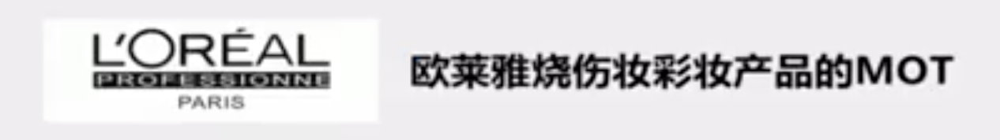

欧莱雅的烧伤妆的转化是因为大量的顾客看了 Ladygaga 的化妆，短短一个月四百多万人观看，实现了十来万单的订单，很多人模仿她拍出了更多的视频。这是欧莱雅的 0 时刻。传统营销的路径已经被前置，我们需要去学会用内容，用社交媒体和顾客参与去主动构建顾客积极的对话和认知。

营销归根结底是**围绕顾客创造顾客新增价值**，企业所有决策都应围绕此展开。

美国西南航空的低成本策略，市场调研人员向公司汇报，根据市场调研，顾客纷纷反映如果公司能够在飞机上给乘客提供鸡肉沙拉，顾客会更加满意，更加愿意乘坐公司的飞机，公司是否提供？西南公司的 CEO 对市场调研人员说，你可以制定任何决策，只要你的这个决策可以更好的使我们成为一家低成本航空公司。最后的结果是西南航空公司提供了鸡肉沙拉，但是是要收费的，而且鸡肉沙拉还很咸，还需要购买矿泉水。所以这个例子说明，营销是永远围绕着目标顾客的核心价值需求的价值创造，是否能为顾客创造更多价值，为企业真正的顾客创造真正的价值，这里顾客真正关注的不是鸡肉沙拉，而是让公司有额外的收入让机票票价降的更低。

## 好营销与坏营销

营销是为了顾客创造价值的一整套市场经营战略，是一种组织层面的思维，是每一个市场当中的人员，组织当中的人员都需要掌握的一整套底层思维。

### 思维底牌

**逻辑** - **想象力** - **人性**

#### 逻辑

可口可乐 35.9% 的市场份额决策逻辑

上个世纪，可口可乐 CEO 走访市场和经销商的市场调研，发现所有人对可口可乐未来发展判断有两派意见

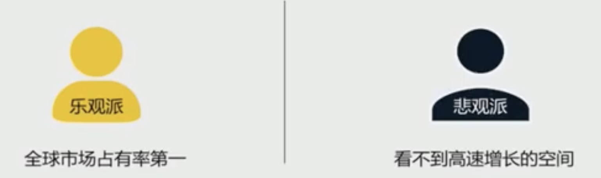

于是可口可乐 CEO 展开了一次西方商业最经典的演讲

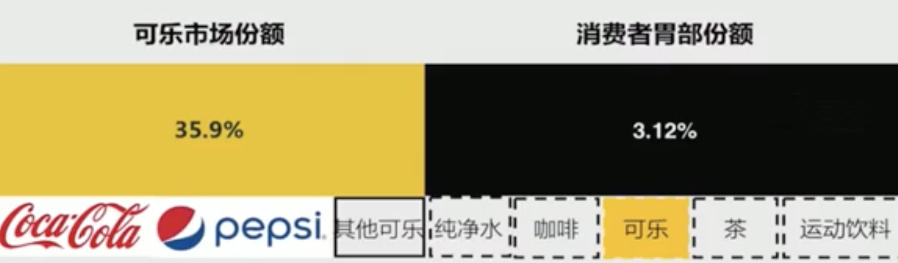

他说可口可乐市场 35.9% 的市场份额是错的，他说据他的观察每一个消费者每天要消费 64 盎司的水，而可口可乐仅仅占其中的 2 盎司，35.9% 是基于可乐行业的数据得到的，但是放入更大的空间中 —— 消费者的胃中，这个份额只有 3.12%。这是两种看待市场份额的眼光，所以该 CEO 认为未来有巨大的增长机会。该战略在可口可乐历史上被称为基于胃部所增长的市场增长战略。因此可口可乐的业务从此开始，进入到了纯净水、咖啡、可乐、茶、运动饮料。此时期也称为可口可乐最快的发展时期之一。

由此我们可以看到好营销的逻辑是

1. 营销是一种市场导向的增长战略，增长思维，是公司战略中的核心元素，代表了增长之路。
2. 好的营销，来自于好的决策逻辑。
   
#### 想象力

营销是科学与艺术的融合，雪花啤酒从 30 亿到 380 亿的增长。

背景

1. 2004 年科特勒咨询为华润做顾问。
2. 华润当时旗下有 50 个啤酒品牌，但是其中没有一个品牌是巨头。
3. 当时挑选出雪花啤酒，希望将其打造成全国第一的品牌。

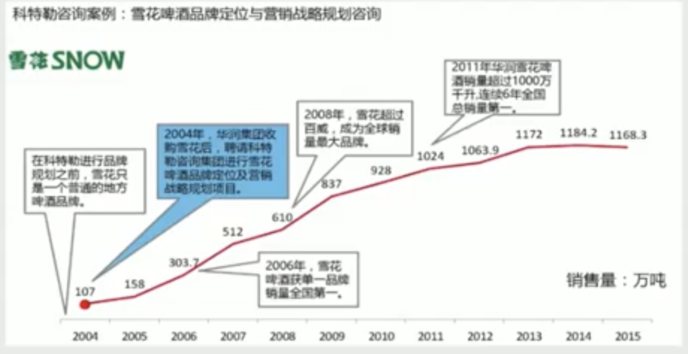

结果只用了三年，做到了全国品牌销量第一，从 06 年的 30 个亿做到 08 年的 380 个亿。

**解决方案：价值观定位切入**

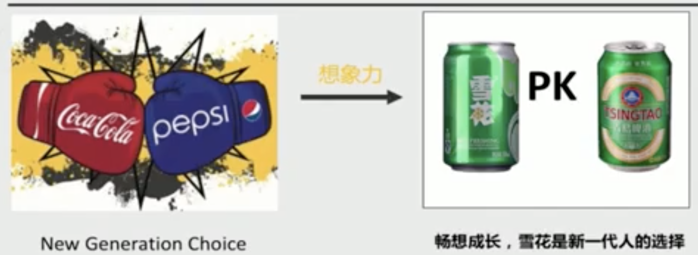

当时中国一谈到啤酒都是产品导向的，比如口味、包装。科特勒美国顾问提了一个问题就是想象美国百事可乐是如何去进攻可口可乐的，一直以来，百事可乐都是在模仿可口可乐的，但是在 80 年代，百事可乐提出了一种新一代的选择，这样一种市场的重建抓住了新一代年轻人的市场，重塑了一个新的品牌。之后华润大胆借鉴的百事挑战可口可乐的方式，将目标锁定在当时的 80 后，提倡畅想成长，雪花是新一代人的选择，正好遇到了 04 年中国足球闯入了世界杯，广告一经播出得到了大量年轻人的追捧，取得了巨大的成功。

由此，我们要知道的是营销要有机会洞察的眼光，要能够审时度势。

1. 营销要有超群的想象力，看到别人看不到的机会。
2. 营销人要建立自己的商战案例库，去横向和纵向借鉴。

想象力不是白来的，每个想象力大师背后都有一个刻意学习的库，比如下棋的高手，他心中一定有无数个棋局和棋谱；绘画大师毕加索所有的作品都有前一任大师的基础和画风，他只是改变画风，形成了自己立体主义的画风，但是背后都是有其他作家作品的元素。

#### 人性

*背景*

1. 一家旅游公司希望用最快、最高效的方式建立目标人群数据库；
2. 有的选择包括：做微博广告，与其他企业交换数据库，或联合促销等；

*问题*

如果你是这个旅游公司的营销人员，你有哪些方法、工具和手段来快捷低成本的建立这个目标人群数据库？

*解决方案*

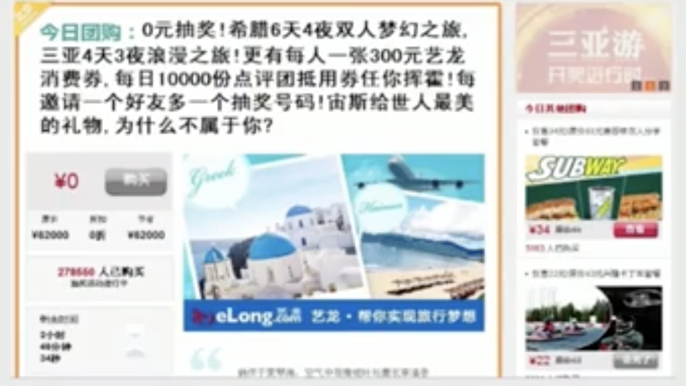

通常人们会想与其他企业交换数据库，或联合促销，做微博广告。在上图中，是一个团购广告，如果在一些信息发布型的网站，比如微博或者其他社交媒体以及在团购网上做活动，有什么不同？前一种信息网站或者社交媒体，这些渠道在消费者心智当中是一个信息传播的终端，这些地方存在着大量纷繁复杂免费的信息，而放在团购网上，它是基于交易的，一般在这里客户需要花重金去购买旅游产品，现在只需要 0 元，这样就会形成极大的反差，一个是免费，一个是付费，这样就会给予消费者这是一个稀缺性机会的心理暗示，抓住这次机会就需要赶紧参与购买。从注意力的获取来讲，这种心理上的暗示将 10 倍于原有的新闻网站。这在行为经济学中称为锚定效应。

锚定效应 (Anchoring effect)：是指当人们需要对某个事件做定量估测时，会将某些特定数值作为起始值，起始值像锚一样制约着估测值。在以后做决策的时候，会不自觉的给予最初获得的信息过多的重视。

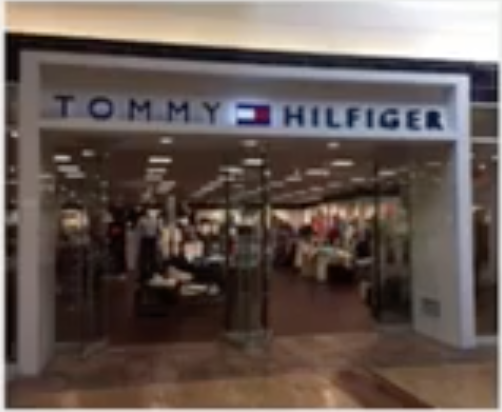

TOMMY 是一个外国进入中国的牌子，很多中国消费者都以为这是一个高端品牌，但是在美国这只是一个中端的服装品牌，但是它在中国卖的非常贵还卖的非常好，因为它在中国的线下是放在奢侈品店旁边，比如 GUCCI，BOSS 这些品牌。所以 GUCCI，BOSS 就形成了它的锚，故而很多人认为它是一个奢侈品品牌。

我们在那张旅游团购中可以看到 0 元抽奖，心理学中暗示如果你不参与就会错过中大奖的机会，这个参与机会是免费，如果不参与就可能丧失了一个豪华度假游的机会，这在行为经济学当中称为人皆患失 (Lose Aversion)。

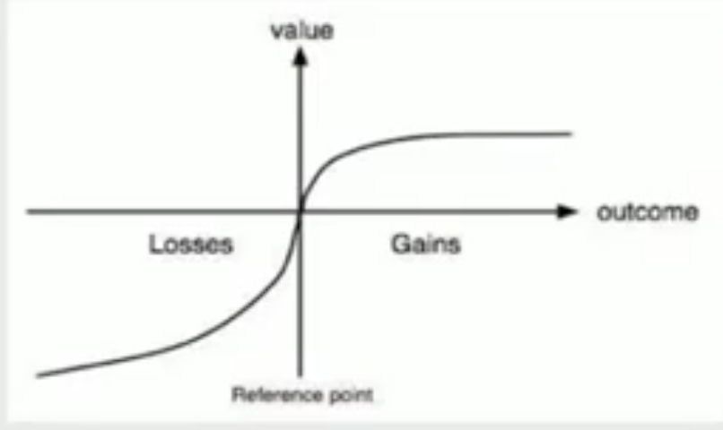

在可以计算的大多数情况下，人们对 "所损失的东西的价值" 估计要高出 "得到相同东西的价值" 的两倍。比如当我们捡到 1 块钱的辛福感是 1 个单位，而丢失 1 块钱的痛苦感是 2 个单位。一个赌客在赌场赢得 100 元让他离开赌场可能觉得没什么，但是输掉 100 元让他离开赌场就很难。

在那张旅游团购中，我们还可以看到每邀请一个好友多一个抽奖号码。这样你和你的朋友都得到一次机会，这是一种共赢的状态，营销学、行为学中称之为社交货币。

社交货币 (Social Currency)：就是利用人们乐于与他人分享的特质塑造自己的产品或思想，从而达到口碑传播的目的，是一种可以诱发传播的因素。

*结果*

该团购内容上线一个半小时有 278550 人参与，以为这不到 90 分钟，278550 人的真实数据库被该公司所得。这就是人性的洞察。

1. 做营销要有能够洞察人性的能力。
2. 人性是人身上抛离不了的程序和固有特质。

### 职能 or 思维方式

很多人只把营销当成一种职能，如公司里的市场部，销售部；如果把营销放大变成一种经营思维的时候就需要组织当中的每一个人都需要去理解都需要去掌握，作为全体成员的思维方式，作为一种经营思维。

四种类型的 CEO

**1P 营销型：只做营销 4P (产品、价格、推广、渠道) 中的 1P**

1. 只做推广 (Promotion)
2. 只看到广告、投放、公关
3. 只做文案
4. 只要 Marketing Communication 层面的营销
   
**4P 营销型：关注营销中的 4P**

比如早年的惠普，他们的市场总监会到市场当中去调查，自己用惠普的产品，经销商用惠普的产品，客户用惠普的产品，产品的最大失误在哪，对于竞争对手来讲最大的缺陷在哪，最大的长处在哪，把这些问题清理出来去反馈给产品部分。这种情况下，营销就变成市场经营当中的一种穿透客户与公司的核心渠道。

中国早期是以渠道为核心，只要把渠道做好了，公司就能发展出来，如 TCL、康师傅。这是以 1P 为主，其他 3P 为辅来打出市场。

**STP 营销型**

做**市场细分 (segmentation)**，**目标市场选择 (target market selection)** 和**定位 (positioning)**，此时营销上升到一种战略功能，比如说品牌，其实就是定位，切割出一个心智战场，把心智当中的品类和公司的品牌进行有效的捆绑。比方说当我们跟小卖店的老板说要买可乐，一般老板会给你一瓶可口可乐或者百事可乐而不会给你其他的杂牌可乐。

细分市场，比如说前几年中国的手机发展非常迅速，当市场当中的增速在趋向于平缓的时候，如何去发现新的市场。如果我们飞到东南亚去看的话，手机市场清一色的都是中国品牌。这就是发现新的细分市场，利用细分市场去带动公司的增长。这也是一种 4P 营销，帮助 CEO 找到一个布兵布局的新的战场新的打法。

**ME 营销型**

Marketing Everywhere，营销无处不在。这个是营销的最高境界。

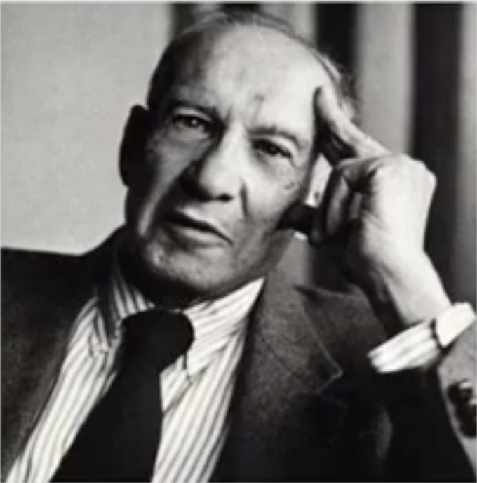

> 企业只有两个核心职能：创新和营销。—— 彼得格鲁克

1. 企业针对客户层面创造价值的一切，包括战略、商业模式等，都在营销领域的范畴之内。
2. 营销是企业的经营中心。
3. 从 CEO 到 CMO，再到执行者，都需要作为经营思维的营销，营销是市场经营中涉及到的一切，但不同层级所要涉及的营销问题是不同的。

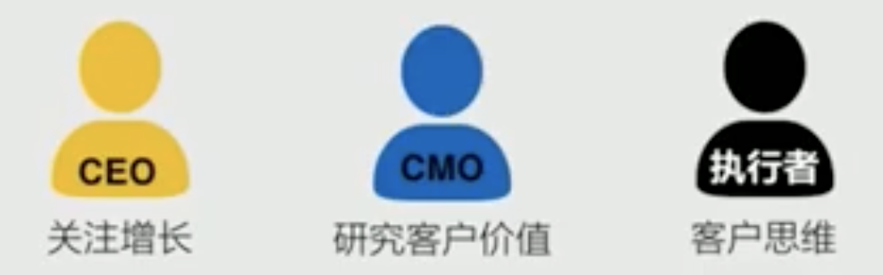

CEO(Chief Executive Officer: 首席执行官) 关注的是增长，除掉资本运作之外，第一个考虑就是从市场客户价值端来增长；从 CMO(Chief Marketing Officer: 首席营销官) 的层面来看，最重要的一点并不是传播、策划活动，而是真正去研究客户价值，从需求出发去带动业务增长。 执行层面，各个部门之间要看到客户思维，需要有效的理解上下游的客户对接背后的需求的时候，企业内部的围墙才能真正的被推倒。

ME 营销可以分为三种

1. 职能和技巧的营销：有人研究卖点、有人研究疯传、有人带流量......
2. 营销战略层面的营销：定位、价值主张、价值品类，价值传递触点......
3. 营销思维层面的营销：整个组织成员都具备营销思维，以顾客为中心，以市场为中心......

**营销金字塔**

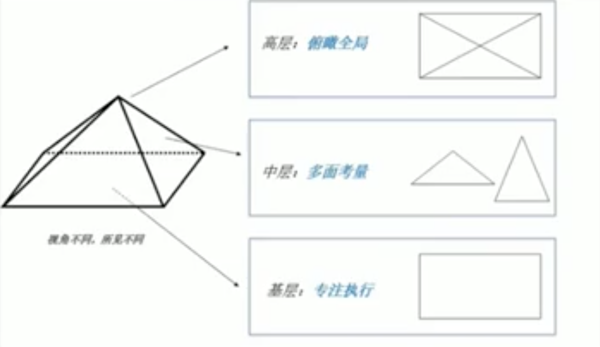

同样一张图，从不同的视角，基层看到的是一个底面的矩形或者平行四边形，为专注执行；中层看到的是金字塔的每一个侧面，是不同的三角形，为多面考量；高层看到的是金字塔上的点平铺下去，为俯瞰全局。

今天中国大部分的企业对营销的理解不到位，要么认为营销岗位变成对接广告和公关公司，要么认为营销等于销售，或者认为品牌比营销要高明，但实际上品牌只是营销当中的一个元素。CEO 应该具备市场导向的战略思维，应该具备以客户价值来去定义产品价值；对于中层来讲，涉及到营销思维包括搭建如何与产品部协调去发展出强势性的产品，如何定价，如何把产品有效的去沟通到市场，如何去组织社群，如何去做销售渠道管理；对基层来讲涉及到市场调研，消费者分析，客户分析，用户体验分析以及营销执行 —— 包括市场活动诉求点的定义以及销售执行。

## 洞察市场机会

本质上是要通过市场信息收集与市场研究，建立对宏观趋势、中观市场竞争与微观顾客的独特理解，并从中发现公司未来的增长机会。**其中信息是入口，洞察是关键，增长机会是着眼点。**

BBDO 的创意哲学 ——RAISE

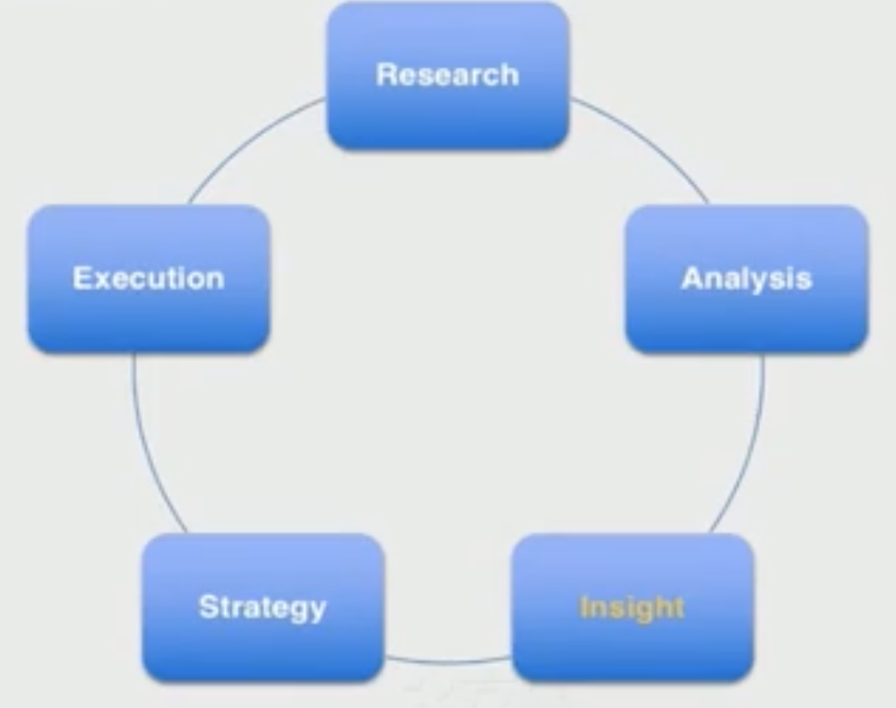

其中有一个环节就是洞察 (Insight)，洞察就是

1. 被人忽视的常识，比如你的顾客一定会忠诚吗？
2. 一反常规的思路突破，比如两星级酒店的价格 VS 四星的品质？
3. 导致理想结果出现的决定因素，比如顾客决策成本中最大的部分是什么？

### 如何洞察

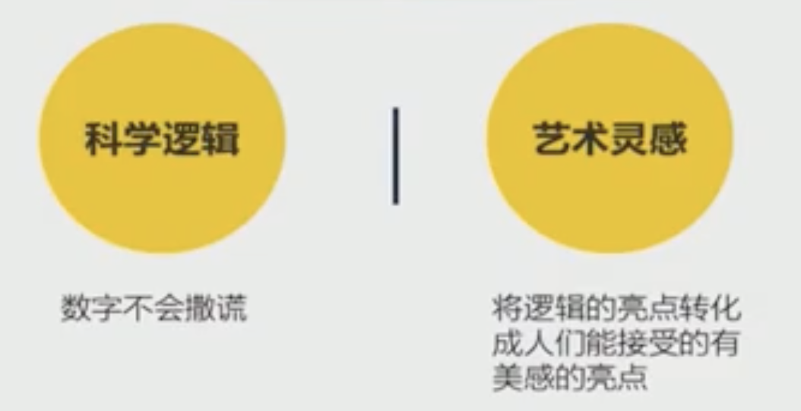

既要有科学逻辑分析的严谨，也要有艺术与灵感发挥的光芒时刻。既可以通过大数据让我们知道更多信息，更多的数据片段能够组合出一个更加全面，更加具有洞察力的结果，这样一些经验就会被一些数据分析的结果所替代，尤其在最近人工智能的使用，更加便捷人们对于经验的替代。就像人的大脑分为左右半球，分别掌管人的感性和理性，在充分发挥数字和逻辑的过程当中，同样要重视艺术和灵感，因为只有它们能够将逻辑的亮点转化为能够使我们能够接受的具有美感的亮点。洞察一定要去建立两种方式向中间汇合，最终能够得到一个真正属于我们自己企业独特的市场洞察。这些知识也是能够使我们企业能够走向未来的核心竞争力。

### 搭建营销信息收集框架

美国中央情报局 CIA—— 击毙本拉登

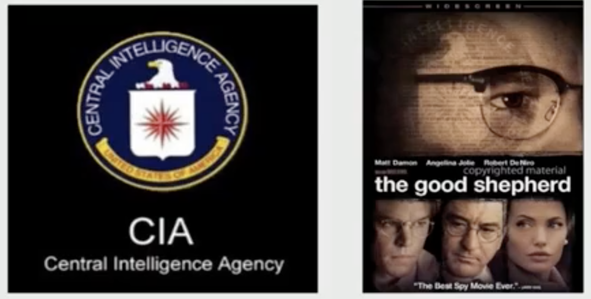

美国中央情报局的主要任务就是公开、机密的收集一些关于国外政府，公司，恐怖组织，个人各种政治、文化、经济各方的情报，并把这些情报与其他情报部门进行共享，同时将这些情报整理之后分发给各个所需要情报的政府部门。同时担任总统和国会的高级情报顾问。

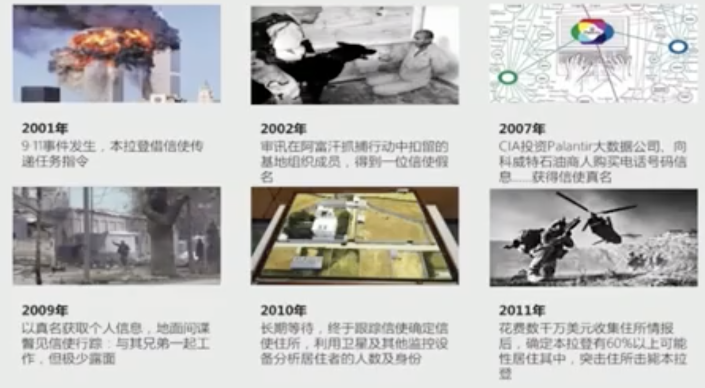

我们以 2001 年追查本拉登的事件来做一个示例。01 年 911 事件的发生使本拉登登上了国际舞台，成为恐怖组织大亨。在此过程中，美国中央情报局一直扮演了去收集情报，在哪里能找到本拉登的工作。这个工作一直持续了将近 10 年，在这个过程当中，CIA 还通过大数据的方式，获取本拉登的藏身居所。一直到 2010 年确定了本拉登的居住地，并将该信息汇报给了美国总统，由美国的海豹特种部队进行实地实施，当场击毙了本拉登。

在这个过程中，我们可以发现 CIA 在这个过程中发挥的很重要的作用，并且与海报突击队进行了明确的分工和配合。这就很像企业中的市场部和销售部之间的配合过程。

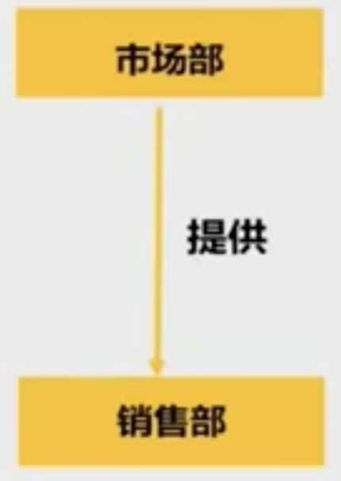

**市场部搜集和洞察市场动向、竞争对手动向、顾客需求等信息，开发向顾客的展示宣传资料、介绍话术等；销售部运用市场部提供的信息和工具，获取订单。**

*建立信息搜集系统的原因*

Marketing = Market + ing

市场是处于一个持续变化的状态，因此企业必须建立自身的营销信息体系，去全面的前瞻地整合和总结这些信息。

营销信息系统 (MIS, Marketing Intelligence System)，对信息进行收集、分类、分析、评估和分发，为市场决策者提供所需的及时和精确的信息。

*搭建营销信息系统的框架步骤*

**1. 确立要解决的问题**

1. 宏观环境
2. 中观竞争：基于品类和需求市场竞争
3. 微观顾客：顾客行为与态度

**2. 建立收集框架**

1. PPT 模型
2. 确定 3 类竞争者

**3. 收集手段和信息来源**

1. 二手信息收集：最广泛的信息渠道与方式
2. 市场调研：定性调研，定量调研，传统调研，大数据调研
   
### 宏观环境分析框架 ——PPT 模型

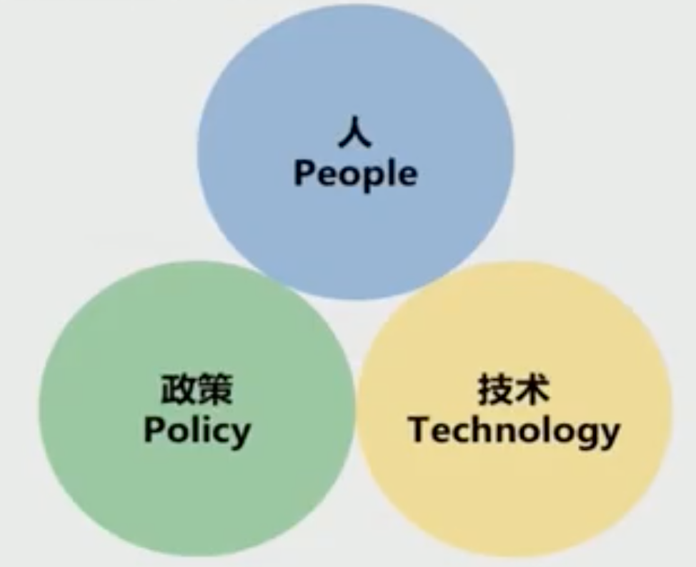

**People**

1. 一般从群体而非个体的细度去研究 (外部特征)
2. 人的内心世界的变迁
3. 基于人生价值观和态度及自我表达方式

从人的外部特征，可以从人的年龄、性别、地域分布、教育水平、收入分布、增长状况六项来进行分析。当前中国城市可以分为一线、新一线的概念；人口迁徙的流向从北到南，从西向东，随着中国经济的发展，很多劳动力也在就近和驻地进行二次创业，离土不离乡，希望能够将在外地学到的技能来支持当地小城镇的发展；对于历史事件变迁的发展，主要是从社会整体的价值观，消费观以及文化领域的变化来进行收集。更需要注意到在沟通年龄段中的文化、世代性差异，比如 70、80、90、00 这样的差异来进行分类，分类背后指向的是一些底层价值，如成功、幸福、爱情、责任这些最基本的人生观的态度以及对于这些价值的自我表达方式，对于如何来建立品牌价值和对话方式尤其重要。对于流行的电视剧、综艺节目可以透视出价值观的热点，社会心态，企业可以给予呼应和强化。

案例：万科邀请马佳佳演讲《不买房的 90 后》

**Policy**

1. 行业的发展指引
2. 政策与限制性文件

**Technology**

能更好的满足顾客需求，或可能创造性满足顾客需求的新技术趋势

### 中观环境分析框架：确定 3 类竞争者

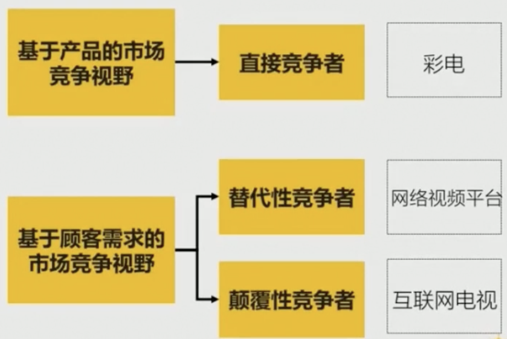

从宏观层面分析后并不足够，还需要从中观层面进行分析，从市场竞争对手来入手，来建立该层面的信息收集。从上图中的两个视角 —— 产品和顾客需求入手可以确定 3 类竞争者 —— 直接竞争者、替代性竞争者、颠覆性竞争者。

以彩电为例，直接竞争者，如康佳，长虹，TCL 等；替代性竞争者网络视频平台，如腾讯、爱奇艺；颠覆性竞争者互联网电视，如小米、乐视。

基于不同的视角，他们所提出的竞争要点也不同，如基于产品市场竞争视野

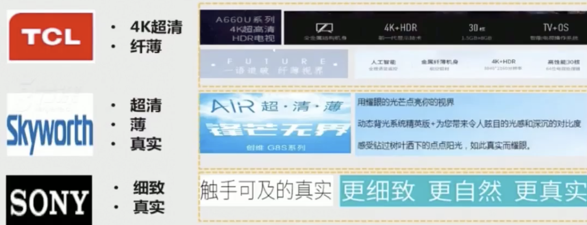

这些都是从产品本身的特点来进行宣传。替代性竞争者提出特点的如下

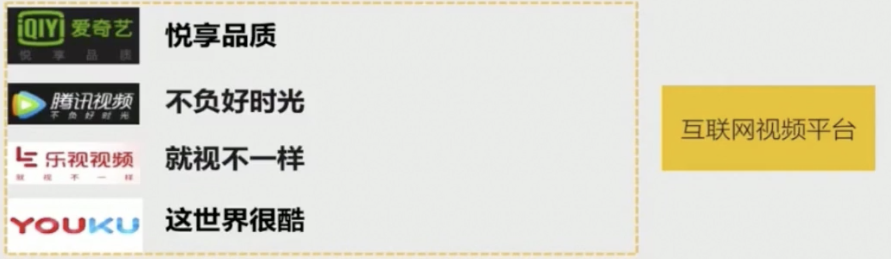

颠覆性竞争者

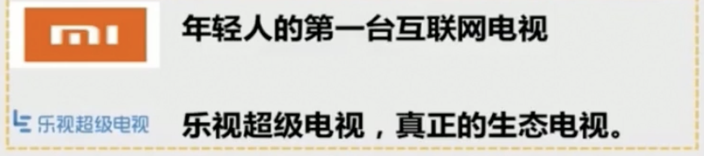

这三种方式不是孰优孰劣的问题，而是需要全面去看待的问题。

## 洞察顾客需求、行为与心理

*洞察顾客的框架*

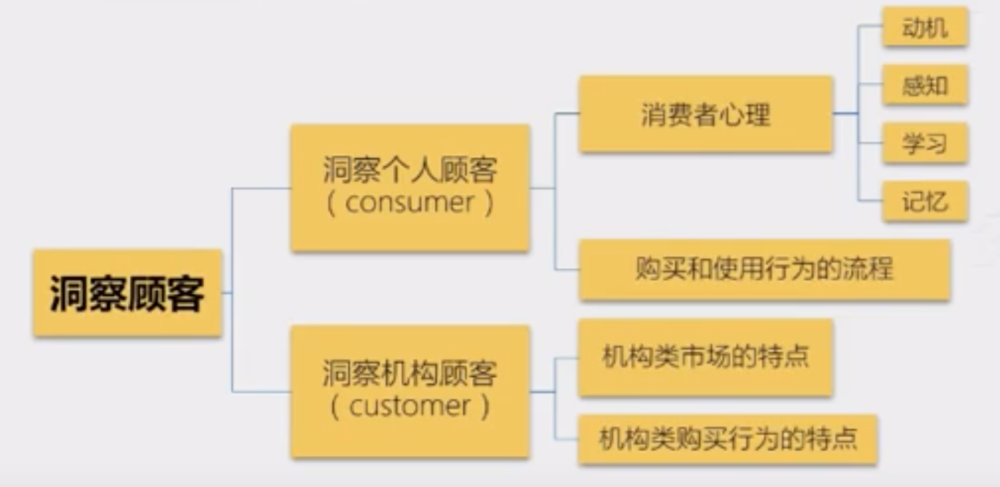

### 2C 消费者心理

#### 动机

动机是行为背后真正的心理原因。

*洞察动机的三种工具*

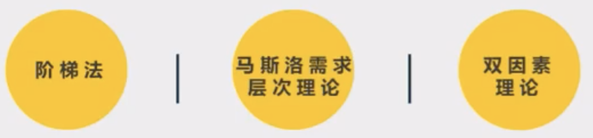

**一、阶梯法**

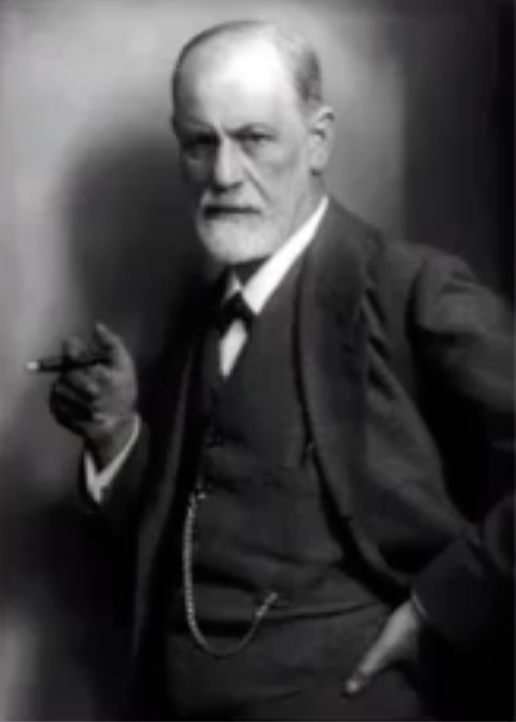

> 影响人行为的心理因素大部分是无意识的，一个人不可能完全理解自己的动机。    —— 弗洛伊德，奥地利心理学家，精神分析学派创始人

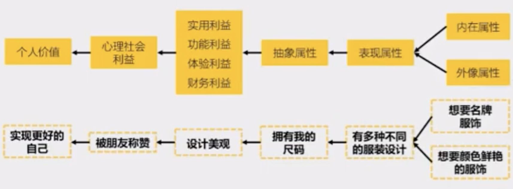

从上面的例子我们可以看到，一个人买衣服的时候，他想要名牌的服装，要色彩鲜艳，在这种情况下企业需要不同的设计，需要符合顾客自己的尺码，这些都源自顾客想要更加的美观，对于美观的重要则来自于社交属性，想被朋友称赞，成为更好的自己。那么我们就需要明白，衣服不只是一件功能、颜色、尺码非常齐全的产品，需要通过这个过程真正需要给顾客的是对更好的自己形成一种契合。

> 灵魂不是栖息于你的肉体，而是你所穿的那件服装之下，你就是你所穿的品牌。   —— 某法国社会学家

通过对顾客对产品有形属性、心理属性以及内心的深层次需要来发掘无法用语言表达的需要。

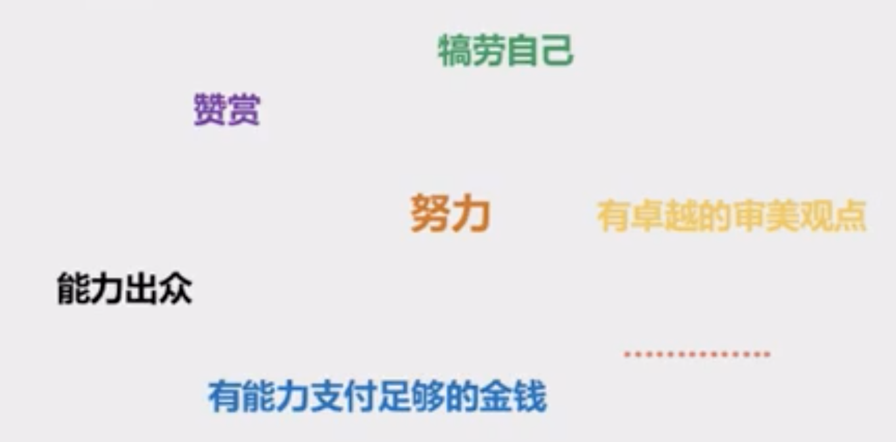

*注意的点*

1. 应把握尺度
2. 应谨慎的、平衡的、有尊严的去对待用户，及对待你挖掘到的用户内心的隐秘想法

**二、马斯洛需求层次理论**

更大的使命让人们可以舍去一些基层的生存需求。

*案例，谷歌创始人谈谷歌的竞争对手*

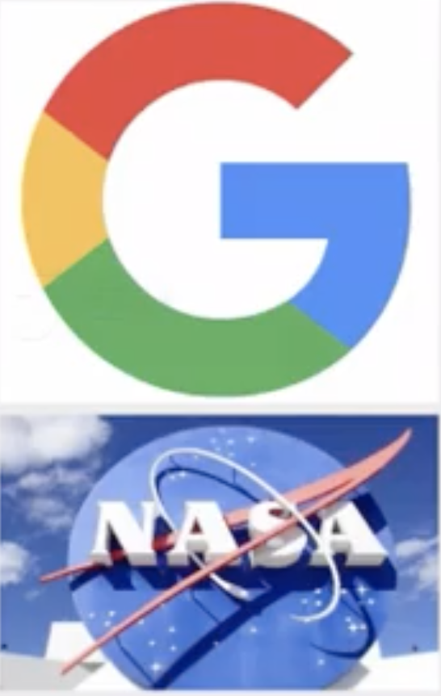

1. 记者：谁是谷歌的竞争对手？
2. 谷歌创始人：谁和我竞争人才，谁就是我的竞争对手。
3. 记者：谁与谷歌争夺人才？
4. 谷歌创始人：NASA
5. 记者：为什么 NASA 会成为谷歌的竞争对手？
6. 谷歌创始人：谷歌的工资是 NASA 的数倍，但是大家还是愿意去 NASA 工作，因为 NASA 是一个自我实现的平台。

从这个案例，我们可以看到每一个企业应该要去打造自己的使命感。

*案例：乔布斯说服可口可乐的高管加入苹果*

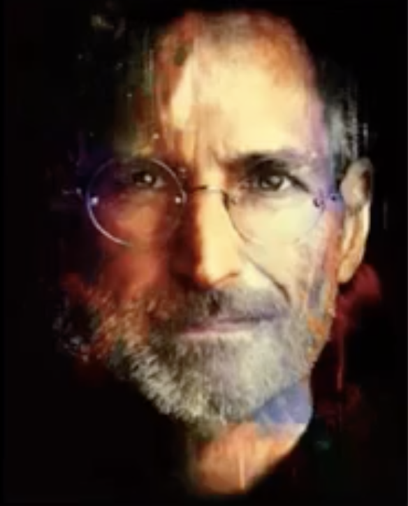

> 你是想卖一辈子糖水，还是跟着我们一起改变世界？             —— 乔布斯

**三个层面的价值观**

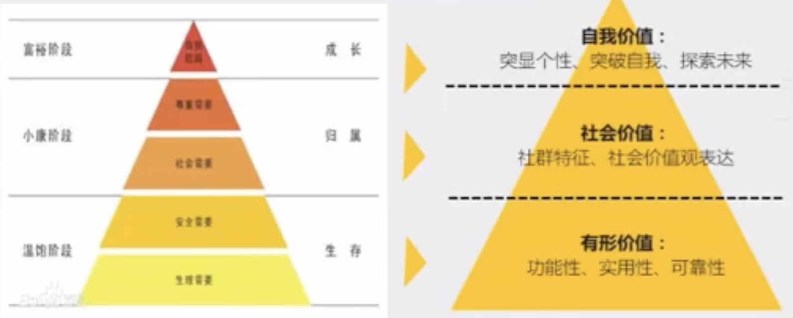

从某种层面来讲，这三个层面的组合就是企业为顾客提供价值的一个整体组合，以小米为例

在有形价值层面，小米给大家提供一种认知就是小米产品的有形价值是非常扎实的一款产品；在社会价值上提出了新国货，为发烧而生，打造一种极客的形象，这里我们可以看到一个好的产品可以标榜自己社群的身份；在自我价值层面，给客户一种年轻、极致、参与感，在这个过程当中，通过参与到某一件事情当中获得的存在感和成就感。

通过马斯洛层级，企业应该为顾客提供全面的价值组合，有时候我们似乎只看到某些企业只是提出一个口号，其实口号的背后有一个丰富的价值组合。在某一场传播的活动当中，可以强化传播效果。

**三、双因素理论**

赫茨伯格的发现：20 世纪 50 年代末期，赫茨伯格和他的助手们在美国匹兹堡地区对二百名工程师、会计师进行了调查访问。结果发现，使职工感到满意的都是属于工作本身或工作内容方面；使职工感到不满的，都是属于工作环境或工作关系方面的。他把前者叫做激励因素，后者叫做保健因素。

赫茨伯格认为人类的需求大致可以分为两点 —— 基础属性和激励因素，基础属性从市场的角度来讲就大概是做到了市场入场资格，做不到马上被踢出局，但是做好了呢，并不会得到赞誉。

案例：由双因素理论看航空公司

1. 基础属性 (保健因素)：必须满足的价值，是入门级别的要求，无法做到，就失去在市场生存的资格；做到没人会因此而给予更大的赞誉，比如安全和准点。
2. 激励因素：有可能成为核心竞争力使企业脱颖而出，比如个性化服务 —— 精美的餐饮，机舱电影。

双因素理论与需要层次理论的关系

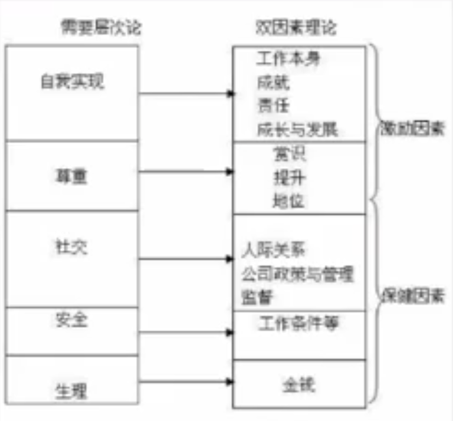

案例：苹果

|      | 营销管理       | 举例          |
| :---- | :---------- | :---------- |
| 激励因素 | 商品独特形象，商品品牌价值，商品的定位，优质的服务等能够提供更多附加值的因素 | 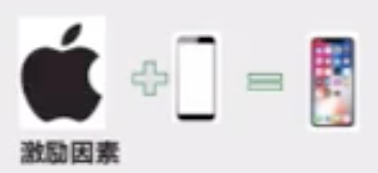 |
| 保健因素 | 商品或服务的基本功能与质量能为消费者提供的基本利益与价值           | 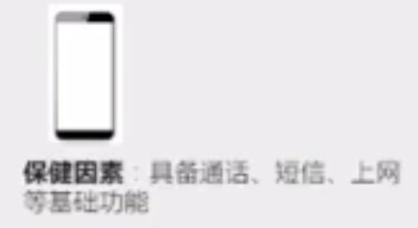 |

#### 感知
 
做营销为什么关注感知？

在营销中，感知比事实重要，因为感知影响消费者的实际行动。

**感知 (preception)** 是指一个人选择、组织和解释接受到的信息，以形成对外部世界有意义的描绘过程。

**影响塑造顾客感知的理论**

**一、选择性注意 (Catch me if you can)**

顾客根据自身的需要和偏好去过滤无关、无趣和缺乏足够刺激的信息。例如

1. 有了孩子后，感觉满大街都是孩子。
2. 想买手机，感觉满大街都是手机广告。

**二、选择性扭曲 (先入为主)**

解读信息时的先入为主倾向，对品牌或者产品留存于认知中的固有印象。

1. 小米手机就是性价比高
2. 德国的产品就是质量好

**三、选择性保留 (一好百好)**

因为信息太多，人无法记住所有接触到的品牌信息，但是会记住那些支持其态度和信仰的信息，并倾向于记住所喜欢产品的优点，而选择记住它竞争对手的缺点，从而强化记忆。

同样手机电池出了问题，对于苹果手机人们会觉得是供应商的问题，对于三星而言则是自身品控不够好。

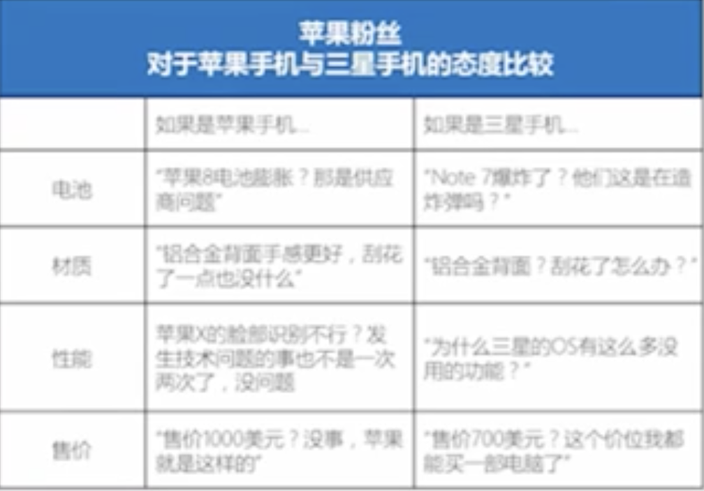

#### 记忆

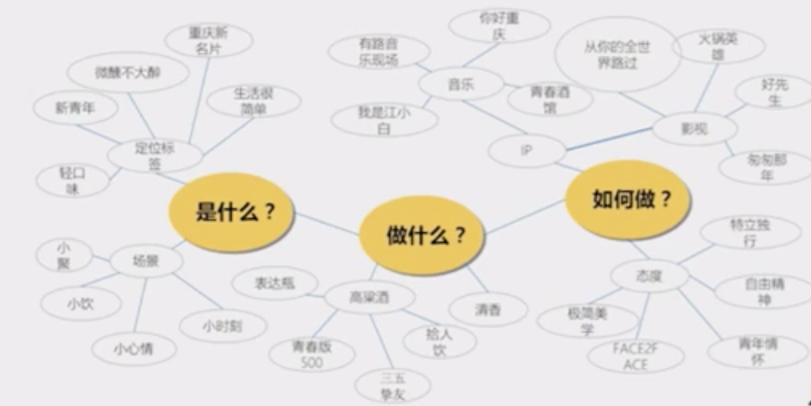

人的认知大概就像上图中的地图，围绕着某一个关键词会有一个个节点，一个节点就是一个信息点，信息点之间又是相连的，是事务在我们大脑中所存在的知识结构。

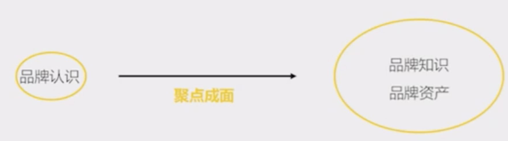

品牌认知其实就是为了去建立一个认知地图，其中的每个节点就是你的品牌核心价值，把这些信息点聚点成面，就形成了你的品牌资产、品牌知识。

##### 行为

经典的五阶段消费者行为流程

1. 问题辨识：意识到有问题，产生购物的心理因素。
2. 信息搜索：围绕问题，搜集相关信息 (搜索引擎 Google，百度，社群发问)
3. 方案评估：基于已搜索信息进行判断，现在愿意相信专家
4. 购买决策：买或不买，及购买时间
5. 购后行为：社交行为 —— 晒朋友圈产品和价格，二次传播

数字时代下，经典五步骤是否发生了较大变化？五个流程先后顺序的变化及某些行动的合并与省略，与购买的决策量级相关。

决策量级低，如绣花针，价格便宜，买错后损失不大，会省略步骤。

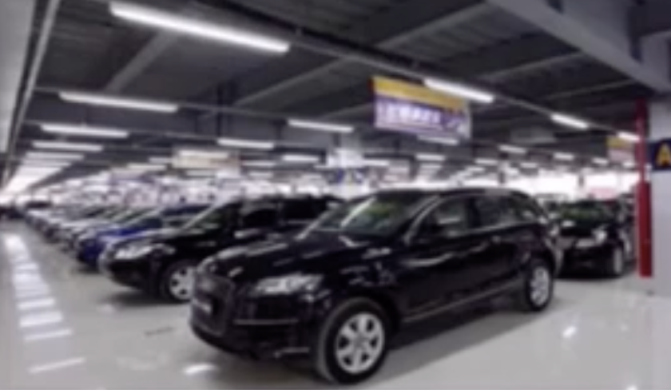

决策量级高，如汽车，金额较高，影响到个人形象，经济状况，可能就会进行五步骤的活动。

某些行为在时点上发生了重叠，导致某些行为看起来像一个行为，但并不代表五阶段行为不存在。

### 2B

#### 2B 市场与 2C 市场的区别

| 2B 市场                    | 2C 市场                       |
| ------------------------ | --------------------------- |
| 购买者是正式机构，而非个人                   | 自然人购买                       |
| 购买目的是再生成，而非最终消费                | 购买目的是最终消费                   |
| 存在购买者与决策者分离，决策者与使用者分离的情况 | 购买者可能就是决策者分离，决策者可能与使用者是同一个人 |
| 顾客数量相对较少                            | 顾客数量很多                      |
| 购买金额巨大                               | 购买金额相对较少                    |
| 购买周期较长，需多次接触                     | 企业内部人员可能与顾客没有接触             |

#### 机构类市场购买的七类参与者
1. 发起者：请求购买物品的人，包括使用者和其他人
2. 使用者：使用产品和服务的人。通常，使用者首先提出购买建议，并协助确定对产品的需求
3. 影响者：影响购买决策的人，他们经常协助确定产品规格并为评价可选方案提供信息。技术人员是非常重要的影响者。
4. 决定者：决定产品需求和供应商的人
5. 批准者：批准决定者和使用者提供的行动方案的人
6. 购买者：有权正式选择供应商并安排购买条款的人
7. 把关者：有权利组织销售人员或销售信息接近采购中心成员的人

#### 市场调研

六大步骤

确定问题和调研内容 -\> 编织调研计划 -\> 收集信息 -\> 分析信息 -\> 展示调研结果 -\> 制定营销决策

*市场调研的悖论*

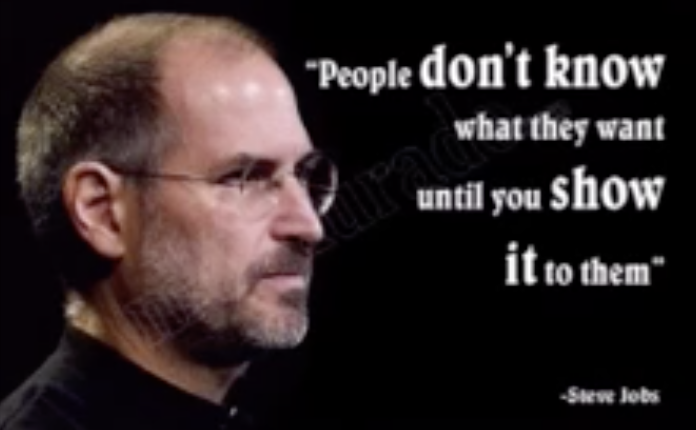

> 在你给他们看到他们想看到的东西之前，人们是不知道他们想要的是什么。  —— 乔布斯

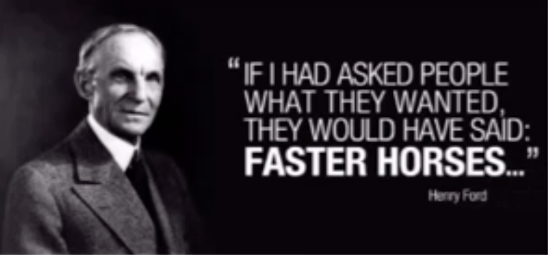

> 如果我当时问人们需要什么，一定是更快的马。    —— 福特

> 人们不知道他不知道的东西。

**需求的满足逻辑**

1. 被动式：在顾客的表述中澄清、发掘顾客的需求，更好的满足顾客的需求。
2. 主动式：在技术推动下，推出革命性和颠覆性的产品去满足需求。
3. 互动式：由企业通过技术和数据提供顾客的需求选择平台，顾客与企业共同创造满足顾客需求的产品。

**大数据在调研中的应用**

大数据和小数据本身并不重要，重要的是你分析数据的逻辑和方法，以及因此而产生的时间成本和金钱成本。

|                  | 数据生成        | 数据整理与收集  | 数据处理与建模 | 结果研读与洞察    |
| ---------------- | -------------- |  ----------- | ----------- | --------------  |
| USAGE: 消费行为类 | 数字手段强，传统方式弱 | 数字手段强，传统手段弱 | 数字手段强，可分析维度更多，但分析方法基本一致  | 基本分析逻辑一致，数字化手段的样本量更接近整体 |
| ATTITUTE：消费态度与需求 | 数字手段和传统手段各有所长，数字手段更客观和持续，传统手段更深入与细致 | 数字手段强，传统手段弱 | 数字手段和传统手段各有特点，数字手段的覆盖性更好 | 基本分析逻辑一致，两者都需要商业智慧的判断  |

1. 客观性受限，数据结果依赖样本的数量
2. 成本投入大，人力成本高以及分发时间久
3. 精准效果难，问卷及调研人员对结果影响大
4. 行为类偏弱，过程行为无法有效监控

**调研的各种方法**

1. 到一线去直接观察与交谈
2. 倾听顾客的声音
3. 依托于网络的小样本定量调研
4. 依托于网络的大数据调研
5. 浸入式研究法：陪同观察和生活，以朋友的视角看待客户
6. 其他方式：借助技术，通过人的瞳孔状态，身体在观看后心跳、汗腺分泌

研究过程中，不要盲目跟随潮流，要根据所需信息深度和决策场景进行判断，基于表达的和背后隐藏的需求，在自身经验和逻辑分析之间达到一种平衡。
