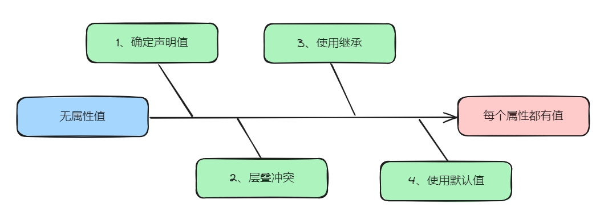

# CSS Tips

## 防脱发神器样式


```css
* {
    margin: 0;
    padding: 0;
    box-sizing: border-box;
}
 
```

## 颜色的alpha通道

`rgba(255, 0, 0, 0.3)`，它与`opacity`属性不同，`rgba`只影响它所应用的元素的颜色。

## 尺寸的百分比单位

百分比单位是一个相对单位，它相对于元素的**参考系**。

普通元素的参考系为其父元素的内容区域，而`<html>`元素的参考系是浏览器窗 口的内容区域。

绝对（固定）定位元素的参考系为父元素中 第一个定位元素的`padding`区域。

## 最大最小宽高

当一个元素的尺寸会自动变化时，给它设置最大最小尺寸，可以防止它变得过大过小。 


## CSS属性值计算过程

在浏览器渲染页面时，会先计算出CSS属性的值，使得html元素中所有css属性都有值，然后根据这些属性值来渲染页面。 



1、确定声明值

参考样式表中没有冲突的声明，作为CSS属性值。

2、层叠冲突

对样式表中有冲突的声明使用层叠规则，确定CSS属性值。

1. 比较重要性

2. 比较特殊性

3. 比较源顺序
   

3、使用继承

对仍然没有值的属性，若可以继承，刚继承父元素的属性值。

4、使用默认值

对仍然没有值的属性，使用默认值。 

## CSS LVHA伪类样式

爱（LoVe）恨（HAte）法则，书写顺序`:link`、`:visited`、`:hover`、`:active`。
