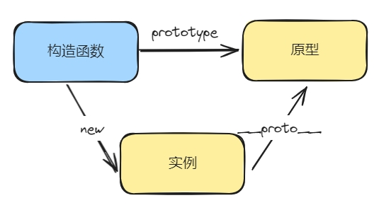
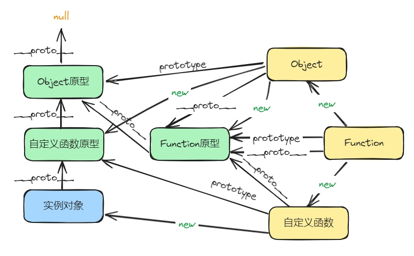
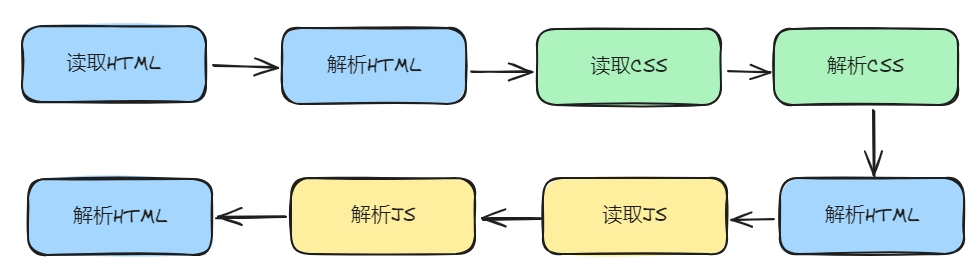

## JS的数据表达

JS提供了三种方式来表达一个数据：

1. 变量
2. 字面量
3. 表达式

程序中任何需要数据的地方，都可使用上面任意一种数据表达。 

## 核心概念

### 数据的存储和传递（值和引用）

JS中，变量存储数据的方式有两种：值和引用。

#### 值类型

- 数值、字符串、布尔值等基本类型的数据，值类型的数据是存储在栈内存中的基本数据，变量存储的是**值本身**。

  - 数值：123, 456
  - 字符串："hello"
  - 布尔值：true/false

#### 引用类型

- 对象、数组、函数等复杂类型的数据，引用类型的数据是存储在堆内存中的对象，变量存储的是**对象的地址**。

#### 函数形参传递

- 值类型：形参和实参是两个独立的变量，改变形参不会影响实参

- 引用类型：形参是实参地址的拷贝，和实参指定同一地址，改变形参会影响实参。如果对形参重新赋值给新变量，则实参不受影响。

### 数据的作用域

JS有两种作用域：全局作用域和函数作用域。

- 内部的作用域可以访问外部，反之则不行。访问时从内向外依次查找。
- 如果在内部作用域中访问了外部，则会产生闭包。
- 内部作用域能访问的外部作用域，取决于函数定义的位置，和调用无关。

作用域内定义的变量、函数声明会提升到作用域的顶部。

### 全局作用域

- 全局对象的属性可以被直接访问
- 给未声明的变量赋值，会自动成为全局对象的变量赋值
- 所有的全局变量、全局函数都会附加到全局对象上

:::tip
全局作用域中声明的变量和函数极有可能造成命名冲突，造成全局环境的污染或暴露。可以通过使用IIFE（Immediately Invoked Function Expression）来强制改变作用域来避免污染全局环境。
:::

### 构造函数

JS中，可以使用构造函数来创建对象。JS所有的对象都是通过构造函数创建的。

- 构造函数名首字母要大写
- 使用new关键字调用构造函数来创建对象
- 构造函数中this指向创建的对象

#### 原型
 

每个构造函数都有一个prototype属性，指向原型对象。

- 原型对象中保存了所有实例共享的属性和方法
- 实例访问属性或方法时，先在实例中查找，如果找不到则去原型对象中查找(隐匿原型__proto__指向构造函数原型)

可以把构造函数的公共成员放到原型对象中，这样所有实例就可以共享这些属性和方法。

#### this的指向 

- 全局作用域中this指向全局对象
- 在函数中使用this，它的指向完全取决于函数是如何被调用的
    | 调用方式 | 示例              | this指向 |
    | -------- | ----------------- | -------- |
    | new调用  | new method()      | 新对象{} |
    | 直接调用 | method()          | 全局对象 |
    | 对象调用 | obj.method()      | 调用对象 |
    | call     | method.call(ctx)  | ctx对象  |
    | apply    | method.apply(ctx) | ctx对象  |

#### 原型链

原型链是JS中实现继承的一种机制。

- 每个对象都有一个隐匿的__proto__属性，指向构造函数的原型对象
- 原型链是对象到原型对象的链条，原型链的终点是Object.prototype，Object.prototype的__proto__属性指向null

 

#### 继承或派生

- 原型链继承：子类可以通过使用`Object.setPrototypeOf(Child.Prototype, Parent.prototype)`把隐式原型指向父类的prototype来实现继承。
- 构造器绑定：子类可以通过call或apply方法调用父类构造函数来实现继承


```js
function Parent() {
  this.a = 1;
  this.b = 2;
  this.cb = function () {
    console.log("parent cb");
  }
}

function Child() {
  this._method = Parent;

  this._method();
  delete this._method;
}
```

### 浏览器渲染原理

- 解析HTML，构建DOM树
  
 

- 解析CSS，构建渲染树
- 布局(Layout)、重排（Reflow），非常耗时
- 绘制(Paint)、重绘（Repaint）


## WebAPI

### DOM

#### DOM尺寸和位置

- window.innerWidth/Height：浏览器窗口的内部宽度和高度，不包括工具栏
- window.screen.width/Height：屏幕分辨率的宽度和高度
- window.outerWidth/Height：浏览器窗口的外部宽度和高度，包括工具栏
- document.documentElement.clientWidth/Height：文档视口的大小，不包括滚动条
- Element.offsetWidth/Height：元素自身的大小，包括边框和内边距
- Element.scrollWidth/Height：元素滚动条的宽度和高度
- Element.clientWidth/Height：元素内容区域的大小，不包括边框和内边距
- Element.getBoundingClientRect().top/left：元素相对于视口的位置

#### 事件传播机制

- 事件捕获：从最外层元素开始，依次向内层元素传播
- 事件冒泡：从内层元素开始，依次向外层元素传播

```js
ele.addEventListener("click", function (e) {}, false); // 第三个参数为true，表示事件在捕获阶段触发，默认为false，表示事件在冒泡阶段触发

```


 