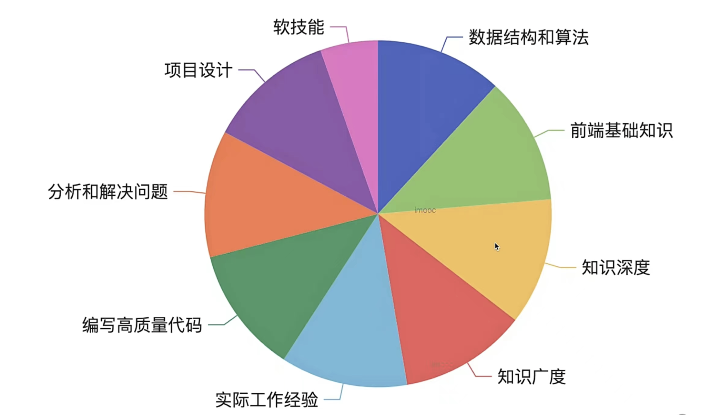

 

 # 常见面试题

 ### 防抖和节流

 区别：
 - 触发频率不同
 - 防抖：在一定时间内没有再次触发，才执行一次函数
 - 节流：在一定时间内只执行一次函数
　
 实现：

 ```js
 // 防抖
 const debounce = (fn = {}, wait = 50, immediate) => {
    let timer
    return function () {
        if (immediate) {
            fn.apply(this, arguments)
        }
        if (timer) {
            clearTimeout(timer)
            timer = null
        }
        timer = setTimeout(() => {
            fn.apply(this, arguments)
        }, wait)
    }
}

// 节流
var throttle = (fn = {}, wait = 0) => {
    let prev = new Date()
    return function () {
        const args = arguments
        const now = new Date()
        if (now - prev > wait) {
            fn.apply(this, args)
            prev = new Date()
        }
    }
}


 ```

 使用场景：
 －　防抖限制执行频率，关注结果
 －　节流限制执行次数，关注过程

 
 # CSS中的基本单位

px, em, rem, vw, vh, %的区别

 - px：绝对单位，固定大小
 - em：相对单位，相对于本元素的字体大小
 - rem：相对单位，相对于根元素的大小
 - vw：相对单位，相对于视窗的宽度
 - vh：相对单位，相对于视窗的高度
 - %：相对单位，相对于父元素的大小


 # 箭头函数

 缺点：

 1. 箭头函数没有自己的this，箭头函数的this是继承外层代码块的this
 2. 没有arguments对象　
 3. 无法通过call、apply、bind改变this指向
 4. 箭头函数不能作为构造函数，不能使用new
 5. 嵌套箭头函数不太好理解　
   　

 什么时候不能使用箭头函数？

 - 对象方法中
 - 动态上下文中的回调函数
 - 结构函数中
 - 原型方法中
 - vue生命周期和method中

# TCP请求中的三次握手和四次挥手

三次握手：

1. 客户端发送一个建立连接请求给服务端
2. 服务端收到请求后，回复一个可以接受信息给客户端
3. 客户端收到信息后，回复一个准备发送信息给服务端

四次挥手：
1. 客户端发送一个断开连接请求给服务端
2. 服务端收到请求后，回复一个收到断开信息给客户端
3. 服务端处理完毕后发送一个可以断开连接信息给客户端
4. 客户端收到信息后，发起一个断开连接请求给服务端

# for...in 和 for...of 的区别

区别：适用于不同数据类型

for...in 用于可枚举数据，如数组、对象、字符串等，得到key

for...of 用于可迭代数据，如数组、字符串，Map，Set等，得到value

- 遍历对象：for...in 可以使用，for...of 不能使用
- 遍历Map，Set: for...of 可以使用，for...in 不能使用
- 遍历Generator: for...of 可以使用，for...in 不能使用


# for await ...of 

用于遍历多个Promise等异步任务　


# offsetHeight、clientHeight、scrollHeight的区别

offsetHeight，offsetWidth：border + padding + 内容高度

clientHeight, clientWidth：padding + 内容高度

scorllHeight, scrollWidth ：padding + 实际内容尺寸


# HTMLCollection 和 NodeList 的区别

HTMLCollection为Eement的集合，NodeList为Node的集合

Node是DOM树中的所有节点

Node是Element的父类

扩展：HTMLCollection和NodeList是伪数组，不能使用数组的方法
```js
const list = document.getElementsByTagName('div')
const arr1 = Array.from(list);
const arr2 = [...list];
const arr3 = [].slice.call(list);
```

# Vue中computed和watch的区别

computed：
- 计算产生新的数据
- 依赖其他属性值，根据其变化而变化
- 有缓存性

watch：
- 监听现有数据
- 当其发生变化时执行回调函数

# Vue组件通信方式有哪些？

- props和$emit
- 自定义事件
- $attrs
- $parent
- $refs 
- provide / inject
- vuex

# vuex中的mautions和actions的区别
mautions：原子操作，必须同步代码

actions：可包含多个mautions，可包含异步代码

# JS严格模式特点

1. 全局变量必须先声明再使用
2. 禁止使用with语句
3. 禁止this指向全局对象
4. 创建eval作用域
5. 函数参数名不能重名

# http跨域请求为什么要发送option请求

option是在跨域请求前的预检查请求，用于判断服务器是否允许跨域请求

option是浏览器主动发送，无需用户干预

浏览器触发option的条件：
1. 请求方式为put、delete
2. 请求头包含自定义字段
3. 请求头包含content-type字段，且不为application/x-www-form-urlencoded、multipart/form-data或text/plain


# JS垃圾清理算法

标记清除算法


# WeakMap/WeakSet
它们都是弱引用，当对象不再需要使用时，会自动回收

它们的key必须是引用类型，且不能重复


# VDOM　真的很快吗

- VDOM并不快，直接操作DOM才是最快的
- 数据驱动视图要有合适的方案，不能全部重建DOM
- VDOM是目前最合适的方案

# for和forEach哪个快
for更快，因为forEach在每次执行中要初始化一个函数来进行调用，而for循环不需要；函数创建会有额外的开销

# JS-Bridge实现原理

- 注入全局API
- URL Scheme

# requestAnimationFrame 和　requestIdleCallback区别

requestAnimationFrame：浏览器下次重绘前调用，高优

requestIdleCallback：在浏览器空闲时执行，低优

# Vue什么时候操作DOM比较合适

mounted阶段和updated阶段都不能保证子组件全部挂载完成

使用$nextTick来渲染DOM

# Vue2、Vue3和React　diff算法的区别

React diff: 仅右移
Vue2 diff: 双端比较
Vue2 diff: 最长递增子序列

# Vue和React中为循环时必须使用key
- vdom diff算法会根据key来判断元素是否删除
- 匹配了key，刚只移动元素，性能较好
- 未匹配key, 删除元素再创建，性能较差

# Vue Router 的三种模式

- hash: 默认模式，使用URL的hash值来作为路由
- web history: 使用URL的history模式，需要服务器支持
- memory history: 不使用URL，将路由保存在内存中